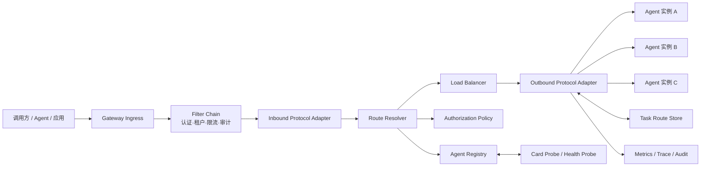
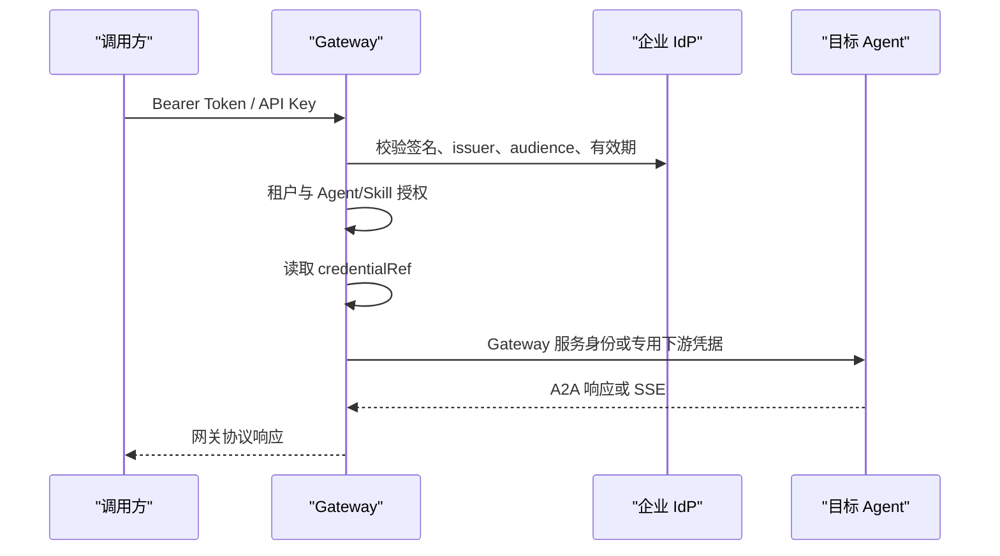
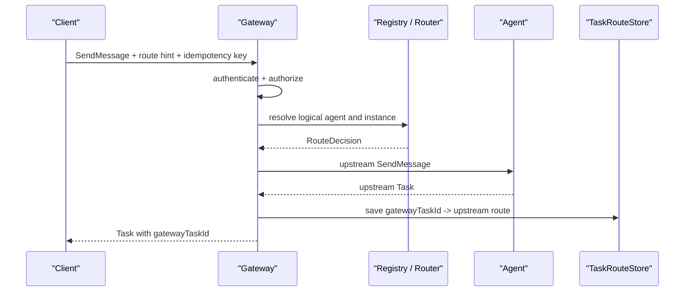

# A2A4J Agent Gateway 架构与详细设计

## 1. 文档信息

| 项目 | 内容 |
| --- | --- |
| 状态 | G9 MVP 已落地；G10+ 企业级扩展待实现 |
| 目标版本 | Gateway MVP |
| 代码基线 | A2A4J `0.0.1`、Java 17、Spring Boot 3.4.x |
| 当前代码协议 | Gateway/Core 新边界以 A2A `1.0` 为基线；旧 Client/Server/Samples 仍保留迁移工作 |
| Gateway 目标协议 | A2A `1.0`，支持 JSON-RPC 和 HTTP+JSON Binding |
| 后续 Binding | A2A `1.0` gRPC |
| 最后更新 | 2026-08-01 |

本文中的“当前能力”以本仓库代码为准；“协议演进”以
[A2A 官方规范](https://a2a-protocol.org/latest/specification/)为参考。

MVP G0-G9 的实施过程、阶段状态、验证命令和发布门槛统一记录在
[mvp-backlog.md](./mvp-backlog.md)。本文只保留架构与实现边界设计，不重复维护阶段进度日志。

本方案假设项目尚无必须保持二进制或 Wire 兼容的生产级 `0.2.1` 用户。项目仍处于
`0.0.1` 阶段，因此选择在建设 Gateway 前直接把主线升级到 A2A `1.0`。如果后续确认
存在旧版调用方，使用独立兼容模块处理，不降低 1.0 核心模型。

### 1.1 文档边界

G0-G4 的代码交付、测试结果和阶段退出结论集中见 [mvp-backlog.md](./mvp-backlog.md) 的
“MVP 实施过程记录”。本文件后续章节描述这些能力的稳定设计约束、接口关系和企业级替换点，
不再按 G0、G1 等阶段追加实施日志。

## 2. 目标与非目标

### 2.1 目标

建设一个统一的 Agent 数据平面入口，提供：

- Agent 注册、Agent Card 拉取、健康探测和能力发现；
- 基于显式 Agent、Skill 和规则的确定性路由；
- 入站认证、租户隔离和最小可用授权；
- 同一逻辑 Agent 多实例间的负载均衡和故障摘除；
- A2A `1.0` JSON-RPC、HTTP+JSON、SSE 任务转发及任务粘滞路由；
- JSON-RPC 与 HTTP+JSON Binding 之间的协议转换；
- 超时、限流、审计、指标和分布式追踪基础能力；
- 清晰的 SPI，使注册中心、状态存储、策略引擎、协议和凭据管理可替换。

### 2.2 MVP 非目标

以下能力不进入首个 MVP：

- 基于 LLM 的开放式语义路由；
- 多 Agent 编排、工作流 DAG 和任务拆分；
- 自动重放可能已经被上游接收的写请求；
- 跨地域双活、全局一致配额和完整计费；
- Agent 市场、审批流、计费结算和 UI 控制台；
- A2A `0.2.1` Wire/API 兼容模块；
- OpenAI、MCP、私有 RPC 等额外协议适配器。

这些能力不是被忽略，而是通过本文定义的扩展接口承接。

## 3. 当前项目评估

### 3.1 可直接复用的能力

| 当前组件 | 可复用点 | 网关中的用法 |
| --- | --- | --- |
| `AgentCard`、`AgentSkill` | Agent 能力描述 | 迁移到 1.0 模型时的语义与测试参考 |
| `JSONRPCRequest/Response` | JSON-RPC 基础载体 | 重构 1.0 JSON-RPC Binding 时复用基础设施 |
| `A2AClient` | 消息、任务、SSE 客户端 API | 设计 1.0 客户端抽象时的语义参考 |
| `CardResolver` | Well-known Agent Card 拉取 | 注册探测器的起点 |
| `Dispatcher` | A2A 方法分派模式 | 入站协议适配的参考，不直接复用为多 Agent 路由器 |
| `TaskStore`、`QueueManager` | 状态和队列 SPI 思路 | 网关状态接口的设计参考 |
| Reactor、Reactor Netty | 非阻塞 HTTP/SSE | 网关数据平面技术基础 |
| Spring Boot 自动配置 | 可替换 Bean 模式 | Gateway Starter 的装配方式 |

### 3.2 需要补齐或隔离的问题

| 现状 | 风险 | 规划处理 |
| --- | --- | --- |
| `DefaultDispatcher` 只持有一个 `A2AServer` | 无法多 Agent 路由 | 新建 Gateway Pipeline，不修改其职责 |
| `DefaultA2AClient` 内部直接创建 `HttpClient` | 不能统一注入凭据、连接池、超时和追踪 | 新建可注入的 `AgentTransport` |
| 多个同步路径调用 `.block()` | WebFlux 数据平面可能阻塞事件循环 | 网关核心全链路使用 `Mono`/`Flux` |
| 默认任务与事件队列为内存实现 | 重启丢失、不能跨实例订阅 | MVP SPI + 内存实现，企业版 Redis/JDBC 实现 |
| Agent Card 只描述单 URL | 不符合 1.0 `supportedInterfaces` | 先升级核心模型，再映射为 Gateway 注册快照 |
| 安全信息主要是描述模型 | 未实际执行认证授权 | Spring Security 入站链 + `AuthorizationPolicy` |
| 示例中的 API Key 为硬编码 | 不可用于生产 | 凭据引用和 `CredentialProvider` |
| Client Starter 当前基本为空 | 无法承载网关客户端治理 | Gateway 使用独立 Starter，不依赖其完成度 |
| 本地规范为 A2A `0.2.1` | 与官方 `1.0` 存在结构性差异 | 主线直接升级 1.0；旧版仅按需提供隔离适配器 |

还应保留当前工作区已有的 `pom.xml` 修改；Gateway 实施不应覆盖无关变更。

### 3.3 当前实现与 a2a4j-core 的实际复用边界

Gateway 不是脱离原项目重新造了一套协议栈，也没有直接把旧的单 Agent
`Dispatcher` 当作多 Agent 网关使用。当前依赖和复用关系如下：

| 部分 | 当前做法 | 说明 |
| --- | --- | --- |
| Maven 依赖 | `a2a4j-gateway-api` 和 `a2a4j-gateway-core` 依赖 `a2a4j-core` | Gateway 与原核心保持同一 Reactor/Jackson/协议工程基线。 |
| 公共协议常量 | 复用 `io.github.a2ap.core.protocol.v1.A2AProtocolV1` | 版本 `1.0`、JSON-RPC 方法集合、Binding 和 Agent Card 路径由原核心统一定义。 |
| 1.0 边界校验 | 复用 `A2AProtocolV1Validator` | Agent Card 和 JSON-RPC envelope 的结构校验不在 Gateway 中复制一份。 |
| Gateway 协议视图 | `GatewayProtocol` 只做 Gateway-facing 常量投影 | 入口适配器引用原核心常量，避免字符串和版本漂移。 |
| 旧 Java 领域模型 | Gateway 数据面当前不直接依赖旧的 `AgentCard`、`Task`、`Message`、`JSONRPCRequest/Response` 对象 | 入站/出站先使用 `GatewayCommand`、`GatewayResult` 和 Jackson JSON；这样可以在 HTTP+JSON 与 JSON-RPC 之间转换，并重写 Gateway/上游 Task ID。 |
| 原 Client/Server/Dispatcher | 不直接作为 Gateway Pipeline | Gateway 使用独立的 `AgentTransport`、`ProtocolAdapter`、`RouteResolver` 和 `GatewayForwarder`，避免单 Agent 责任与多租户治理耦合。 |

因此，当前实现是“复用原核心的协议基础和工程依赖，新增 Gateway 编排与治理能力”，而不是
“完全重写 a2a4j-core”，也不是“只在旧 Dispatcher 外面包一层”。后续如果 1.0 领域模型稳定，
可以继续让 Gateway 的 JSON 适配器逐步收敛到生成模型，但不应把路由、鉴权、Task Route 和
多实例治理重新塞回 `a2a4j-core`。

## 4. 总体架构

### 4.1 逻辑架构



### 4.2 数据平面和控制平面

MVP 可在同一进程部署，但包和接口要分离。

| 平面 | 职责 | MVP | 企业版 |
| --- | --- | --- | --- |
| 数据平面 | 鉴权、路由、转发、SSE、任务粘滞 | 单进程、可多副本但状态能力有限 | 无状态多副本、跨区部署 |
| 控制平面 | Agent 注册、策略、配置发布、状态汇聚 | YAML 配置 + 只读查询 API | 独立服务、审批、版本化发布 |
| 状态平面 | 任务映射、幂等、健康、配额 | 内存实现 | Redis/PostgreSQL/Kafka 等 |

### 4.3 请求管线

固定执行顺序如下：

1. 生成或接收 `traceId`、`requestId`，限制请求大小和 Content-Type；
2. 认证调用方，构建不可变 `PrincipalContext`；
3. 解析租户、协议版本、目标 Agent/Skill 和幂等键；
4. 入站协议适配器转换为统一 `GatewayCommand`；
5. 授权策略过滤调用方可见、可调用的 Agent/Skill；
6. 路由解析得到一个逻辑 Agent；
7. 新任务通过负载均衡选择健康实例，已有任务从 `TaskRouteStore` 定位实例；
8. 按入站 Binding、Agent Card 偏好和策略选择兼容的 `AgentInterface`；
9. 从 `CredentialProvider` 获取出站身份；
10. 出站适配器发送请求并规范化响应；
11. 创建或更新任务映射，对外重写为 Gateway Task ID；
12. 返回 JSON 或桥接 SSE，同时记录指标、追踪和审计结果。

任何异常都必须在协议边界内被映射，不能向调用方暴露堆栈、内部 URL 或凭据。

## 5. 模块与包设计

### 5.1 Maven 模块

```text
a2a4j-core/
  直接升级为 A2A 1.0 数据模型、抽象操作和公共协议语义
a2a4j-gateway-api/
  仅包含稳定的 Gateway 领域对象、SPI 和异常，不依赖 Spring
a2a4j-gateway-core/
  路由、选择、任务映射、转发编排、1.0 JSON-RPC/HTTP+JSON 适配
a2a4j-gateway-spring-boot-starter/
  WebFlux 入口、Spring Security、配置、Actuator、自动装配
a2a4j-samples/gateway/
  可运行示例，连接两个升级后的 A2A 1.0 Agent
a2a4j-compat-v021/
  非 MVP；确认存在旧版兼容需求后才增加
```

实施顺序是先升级 `a2a4j-core`、Client、Server Starter 和 Samples 的协议模型，再
增加 Gateway 模块。根 `pom.xml` 和 BOM 在实现阶段调整；不要覆盖当前工作区已有的
无关构建配置变更。

### 5.2 建议包结构

```text
io.github.a2ap.gateway.api
  model/
  spi/
  error/
io.github.a2ap.gateway.core
  discovery/
  routing/
  loadbalance/
  forwarding/
  task/
  protocol/a2a/v100/jsonrpc/
  protocol/a2a/v100/httpjson/
  protocol/a2a/v100/common/
  security/
  observability/
io.github.a2ap.gateway.spring
  autoconfigure/
  web/
  security/
  actuator/
```

### 5.3 关键 SPI

以下是设计级签名，实施时可调整命名，但不应合并职责。

```java
public interface AgentRegistry {
    Flux<AgentDefinition> list(AgentQuery query);
    Mono<AgentDefinition> get(String tenantId, String agentId);
    Flux<AgentDefinition> findBySkill(String tenantId, String skillId);
}

public interface RouteResolver {
    Mono<RouteDecision> resolve(GatewayCommand command, RoutingContext context);
}

public interface AgentLoadBalancer {
    Mono<AgentInstance> choose(
            AgentDefinition agent,
            GatewayCommand command,
            RoutingContext context);
}

public interface AgentInterfaceSelector {
    Mono<AgentInterface> choose(
            AgentInstance instance,
            ProtocolDescriptor inbound,
            GatewayCommand command);
}

public interface ProtocolAdapter {
    ProtocolDescriptor descriptor();
    Mono<GatewayCommand> decode(InboundExchange exchange);
    Mono<OutboundRequest> encode(
            GatewayCommand command,
            AgentInstance target);
    Flux<GatewayEvent> decodeResponse(OutboundResponse response);
}

public interface AgentTransport {
    Flux<OutboundResponse> exchange(
            AgentInstance target,
            OutboundRequest request,
            OutboundCredentials credentials);
}

public interface TaskRouteStore {
    Mono<TaskRoute> find(String tenantId, String gatewayTaskId);
    Mono<TaskRoutePage> list(TaskRouteQuery query);
    Mono<Void> save(TaskRoute route);
    Mono<Void> touch(String tenantId, String gatewayTaskId, Instant expiresAt);
}

public interface IdempotencyStore {
    Mono<IdempotencyRecord> find(String tenantId, String key);
    Mono<IdempotencyRecord> begin(String tenantId, String key, String requestHash);
    Mono<Void> complete(String tenantId, String key, GatewayResult result);
    Mono<Void> markOutcomeUnknown(String tenantId, String key);
}

public interface AuthorizationPolicy {
    Mono<AuthorizationDecision> authorize(
            PrincipalContext principal,
            GatewayCommand command,
            AgentDefinition agent);
}

public interface CredentialProvider {
    Mono<OutboundCredentials> resolve(
            String tenantId,
            String credentialRef,
            AgentInstance target);
}
```

所有 SPI 必须：

- 使用不可变输入对象；
- 保持异步，不返回阻塞式数据库或网络结果；
- 显式携带 `tenantId`；
- 定义超时和可观测标签；
- 不在异常消息中包含 secret。

## 6. 核心领域模型

### 6.1 Agent 定义

```text
AgentDefinition
  tenantId
  agentId                 网关内稳定标识
  displayName
  enabled
  skills[]                规范化的 skillId、tags、input/output modes
  routingLabels{}         region、environment、costTier 等
  protocolPolicy          允许的入站/出站版本
  instances[]

AgentInstance
  instanceId
  cardUrl
  interfaces[]
  weight
  credentialRef
  healthStatus
  lastCardHash
  lastCheckedAt

AgentInterface
  interfaceKey
  endpointUrl
  protocolBinding          JSONRPC、HTTP+JSON，后续 GRPC
  protocolVersion
  upstreamTenant
```

Agent Card 是远端声明，不是控制平面的完整事实。租户、权重、凭据引用、允许的网络
范围和路由标签必须由网关配置管理，不能信任远端 Card 自行提供。

### 6.2 统一命令

```text
GatewayCommand
  operation               SEND_MESSAGE、SEND_STREAMING_MESSAGE、GET_TASK、
                          LIST_TASKS、CANCEL_TASK、SUBSCRIBE_TO_TASK...
  tenantId
  principal
  targetHint              agentId、skillId、labels
  gatewayTaskId
  gatewayContextId
  message
  configuration
  metadata
  idempotencyKey
  inboundProtocol
  requestedProtocolVersion
  extensions[]
```

`GatewayCommand` 是协议无关的内部对象。不能把 `JSONRPCRequest` 直接传入路由器，
否则后续增加 HTTP+JSON 或 gRPC 时会污染核心逻辑。

### 6.3 任务路由

```text
TaskRoute
  tenantId
  gatewayTaskId
  gatewayContextId
  agentId
  instanceId
  interfaceKey
  upstreamTaskId
  upstreamContextId
  protocolBinding
  protocolVersion
  principalFingerprint
  idempotencyKey
  state
  createdAt
  updatedAt
  expiresAt
```

核心约束：

- `(tenantId, gatewayTaskId)` 唯一；
- `(tenantId, idempotencyKey)` 在有效期内唯一；
- 后续 `GetTask`、`CancelTask`、`SubscribeToTask` 不再负载均衡；
- 对外永远返回 `gatewayTaskId`，上游 ID 只保存在可信状态层；
- 查询任务时再次执行授权，防止仅凭 Task ID 越权；
- 任务终态后保留一段可配置时间，再由后台清理。

## 7. Agent 发现与注册

### 7.1 MVP 注册来源

MVP 采用“配置为事实源、远程 Card 为声明源”：

1. 运维在 YAML 中配置逻辑 Agent 和实例的 `cardUrl`；
2. `AgentCardProbe` 启动时和定时拉取配置中的 `cardUrl`，请求携带
   `A2A-Version: 1.0`；A2A 1.0 的规范路径是 `/.well-known/agent-card.json`，示例 Agent
   仅使用 A2A 1.0 的 `/.well-known/agent-card.json`；
3. 校验 `supportedInterfaces`、`protocolBinding`、`protocolVersion`、Skill、
   输入输出模式，并对 Card endpoint 重新执行 URL 策略；签名/信任源留给后续企业增量；
4. 规范化后生成内存快照；
5. Card 变化时以 hash 记录并原子替换快照；
6. 连续失败达到阈值后将实例标记为 `UNHEALTHY`，不立即删除。

MVP 不开放匿名动态注册 API。当前通过 `AgentRegistry` 提供 tenant-scoped 查询 SPI；G3
已经提供安全过滤链和授权策略，具体 HTTP 查询资源已随 G7 数据面入口开放。后续控制平面
可以实现同一个 `AgentRegistry` SPI。

### 7.2 发现查询 API

| 方法 | 路径 | 用途 |
| --- | --- | --- |
| `GET` | `/.well-known/agent-card.json` | 规划中的 Gateway 聚合 Card；当前 MVP 未暴露该入口 |
| `GET` | `/gateway/v1/agents` | 返回当前主体可见的逻辑 Agent |
| `GET` | `/gateway/v1/agents/{agentId}` | 返回规范化 Agent 能力 |
| `GET` | `/gateway/v1/agents/{agentId}/card` | 返回代理后的公共 Agent Card |

聚合 Card 只声明 Gateway 确实支持的能力，不应简单合并所有下游能力。若部分实例
不支持 streaming，则逻辑 Agent 默认不得声明 streaming，除非路由策略能保证请求
只进入支持该能力的实例。

### 7.3 SSRF 与信任边界

- `cardUrl` 仅来自受控配置或已认证的控制平面；
- 默认只允许 HTTPS；开发环境可显式开启 HTTP；
- 解析 DNS 后仍需校验目标 IP，防止重绑定绕过；
- 默认拒绝 loopback、link-local 和云元数据地址；
- 企业内网 Agent 通过明确 CIDR allowlist 放行；
- Card 中的 endpoint 必须再次经过相同网络策略校验；
- MVP 只接受 `protocolVersion: "1.0"`，不进行静默降级；
- 限制响应大小、重定向次数和拉取超时。

## 8. 路由设计

### 8.1 路由优先级

MVP 使用确定性优先级：

1. 已有 `gatewayTaskId`：从任务路由表解析；
2. URL 中显式指定 `agentId`；
3. 请求头 `X-A2A-Target-Agent`；
4. 请求头 `X-A2A-Target-Skill`；
5. 租户默认 Agent；
6. 无唯一结果则拒绝，不做猜测。

显式 Agent 与 Skill 条件冲突时返回路由冲突错误；Skill 匹配多个 Agent 且没有
优先级规则时返回候选列表，不随机选择。

### 8.2 数据面入口

| 方法 | 路径 | 说明 |
| --- | --- | --- |
| `POST` | `/gateway/v1/agents/{agentId}/a2a` | A2A 1.0 JSON-RPC 入口 |
| `POST` | `/gateway/v1/a2a` | 通过路由 Header 选择 Agent 的 JSON-RPC 入口 |
| `POST` | `/gateway/v1/agents/{agentId}/message:send` | A2A 1.0 HTTP+JSON Send Message |
| `POST` | `/gateway/v1/agents/{agentId}/message:stream` | A2A 1.0 HTTP+JSON SSE |
| `GET` | `/gateway/v1/agents/{agentId}/tasks/{id}` | A2A 1.0 HTTP+JSON Get Task |
| `GET` | `/gateway/v1/agents/{agentId}/tasks` | A2A 1.0 HTTP+JSON List Tasks |
| `POST` | `/gateway/v1/agents/{agentId}/tasks/{id}:cancel` | A2A 1.0 HTTP+JSON Cancel Task |
| `POST` | `/gateway/v1/agents/{agentId}/tasks/{id}:subscribe` | A2A 1.0 HTTP+JSON Subscribe to Task |

HTTP+JSON Send Message 的 MVP 请求示例：

```json
{
  "message": {
    "messageId": "msg-20260731-001",
    "role": "ROLE_USER",
    "parts": [
      {
        "text": "总结本季度行业变化"
      }
    ]
  }
}
```

请求可通过 `A2A-Version: 1.0` Header 携带版本；同时接受规范允许的同名请求参数。
当前 MVP 在未携带版本时按 `1.0` 处理，以兼容未显式发送 Header 的客户端；显式携带非 `1.0`
版本时返回 `VersionNotSupportedError`，不会把其他版本静默升级为 `1.0`。按 Skill 路由时，通过
`X-A2A-Target-Skill: web-research` 指定；路由提示不
混入标准 A2A 消息体。

### 8.3 负载均衡

MVP 推荐“加权最少在途请求”：

```text
score = activeRequests / weight
```

从健康且满足协议/能力约束的实例中选择最小 score，平分时轮询。选择完成后：

- 在途计数必须在成功、错误和取消时都释放；
- 同一 Task 的后续请求粘滞到原实例；
- 实例不可用时，已有任务默认返回 `AgentUnavailable`，不能迁移到其他实例；
- 只有 Agent 明确支持共享任务存储时，未来才能开启跨实例任务迁移。

### 8.4 健康与熔断

MVP 包含：

- 主动探测：Card endpoint 或配置的 health endpoint；
- 被动统计：连接失败、超时、5xx、协议解析错误；
- 状态：`UNKNOWN`、`HEALTHY`、`DEGRADED`、`UNHEALTHY`；
- 熔断：连续失败阈值、打开窗口、半开探测；
- 手工禁用优先级高于探测结果。

健康状态只影响新任务。已有任务仍保留映射，并返回明确的暂时不可用错误。

## 9. 鉴权与授权

### 9.1 两段身份



默认不把调用方 Bearer Token 透传给 Agent。若企业场景需要 On-Behalf-Of，必须作为
显式凭据策略实现，并限制 audience 与 scope。

### 9.2 MVP 安全能力

- Starter 的安全入口由 `a2a.gateway.security.enabled` 显式开启，默认关闭，避免未配置 IdP
  时改变现有应用行为；
- 入站支持 JWT Bearer，验证 `iss`、`aud`、签名、`exp`、`nbf` 和可配置时钟偏差；
- 开发模式可配置静态 API Key，但默认关闭，且 secret 只允许通过 `secret-env` 读取；
- `tenantId` 来自可信 Claim 映射，不接受普通请求任意指定；
- 权限粒度至少为 `agent:discover`、`agent:invoke:{agentId}`、
  `skill:invoke:{skillId}`、`task:read`、`task:cancel`；
- 管理和业务入口使用不同 path 与权限；
- 凭据只存 `env://NAME` 等引用，具体 secret 由环境变量、Kubernetes Secret 或 Vault provider 提供；
- 日志脱敏 `Authorization`、API Key、Cookie、文件字节和敏感 Part，认证 token 不向下游透传。

### 9.3 授权缓存

允许短时缓存策略结果，但 key 必须至少包含：

```text
tenantId + principalId + policyVersion + agentId + skillId + operation
```

拒绝结果的缓存时间应更短。高风险权限撤销时必须支持主动失效。

## 10. 协议转换与版本策略

### 10.1 MVP 支持矩阵

| 北向 | 南向 | MVP | 说明 |
| --- | --- | --- | --- |
| A2A `1.0` JSON-RPC | A2A `1.0` JSON-RPC | 是 | 同 Binding 转发并重写 Task ID |
| A2A `1.0` HTTP+JSON | A2A `1.0` HTTP+JSON | 是 | 同 Binding 转发 |
| A2A `1.0` JSON-RPC | A2A `1.0` HTTP+JSON | 是 | 经统一抽象操作转换 |
| A2A `1.0` HTTP+JSON | A2A `1.0` JSON-RPC | 是 | 经统一抽象操作转换 |
| A2A `1.0` SSE | A2A `1.0` SSE | 是 | 保持事件顺序的流式桥接 |
| A2A `1.0` gRPC | 任意 A2A `1.0` Binding | 后续 | 基于同一官方 Proto 模型 |
| A2A `0.2.1` | A2A `1.0` | 可选后续 | 仅在确认存在存量需求时实现 |

### 10.2 直接升级到 A2A 1.0

A2A `1.0` 与当前本地 `0.2.1` 不只是字段增加，主要差异包括：

- 协议版本协商和 `A2A-Version` 服务参数；
- 一个 Agent 声明多个 `supportedInterfaces`；
- JSON-RPC、gRPC、HTTP+JSON 三种正式绑定；
- 数据包装和类型判别方式变化；
- 新的操作、错误和扩展机制。

由于当前项目版本是 `0.0.1`，本方案接受一次明确的破坏性升级：

```text
specification/a2a.proto             # 固定官方 1.0 发布版本和校验值
a2a4j-core                          # 1.0 模型与抽象操作
gateway/protocol/a2a/v100/jsonrpc   # JSON-RPC Binding
gateway/protocol/a2a/v100/httpjson  # HTTP+JSON Binding
```

实施要求：

- 优先依据官方 `a2a.proto` 生成或校验 1.0 Wire 模型，避免手写模型漂移；
- 同一变更中迁移 Client、Server Starter、Samples、规范快照和测试；
- 删除旧协议造成的字段、枚举和方法歧义，不在 1.0 核心 API 中保留 deprecated
  Wire 结构；
- 使用发布说明标注 Java API 和 Wire 格式均不兼容；
- Gateway 核心仍不直接使用 Agent Card 做路由状态，注册阶段转换成自有的
  `AgentDefinition` 快照；
- 如果出现真实旧版需求，再增加独立 `a2a4j-compat-v021`，其生命周期和测试矩阵
  与 1.0 主线分开。

### 10.3 转换原则

- 能无损映射的字段完整保留；
- JSON-RPC 和 HTTP+JSON 必须保持同一抽象操作的功能、行为、错误和授权等价；
- 不能跨 Binding 映射的字段放入受命名空间保护的 metadata；
- 安全字段和凭据永不进入业务 payload；
- 发生有损转换时记录指标，并可通过策略拒绝；
- 流式事件保持同一 Task 内的顺序；
- 上游协议错误先转成统一错误，再映射到北向协议；
- `A2A-Version` 缺失时当前 MVP 默认按 `1.0` 处理；显式非 `1.0` 版本返回
  `VersionNotSupportedError`，其他版本不会被静默升级；
- 每个 Binding 适配器必须有 1.0 契约测试和 golden files。

建议的 metadata 命名空间：

```text
io.github.a2ap.gateway.route.*
io.github.a2ap.gateway.protocol.*
io.github.a2ap.gateway.audit.*
```

## 11. 任务转发与流式处理

### 11.1 新任务



如果响应在到达网关前连接断开，网关不能确认 Agent 是否已接收请求。此时不得把
`SendMessage` 自动发往另一个实例。调用方可携带相同 `Idempotency-Key` 查询或重试，
具体结果由幂等记录状态决定。

### 11.2 已有任务

`GetTask`、`CancelTask` 和 `SubscribeToTask` 的处理顺序：

1. 以租户和 Gateway Task ID 查询路由；
2. 校验当前主体是否有权访问该任务；
3. 找到原逻辑 Agent、实例、协议和上游 Task ID；
4. 把 Gateway ID 改写为上游 ID；
5. 调用原实例；
6. 把响应中的 Task/Context ID 改写回 Gateway ID。

### 11.3 List Tasks

`ListTasks` 不能随机代理给某一个实例，否则在实例不共享任务存储时会返回不完整结果。
MVP 使用 Gateway Task Route 作为列表索引：

1. 按调用方授权范围、tenant、agent、context、status 和 Gateway cursor 查询一页路由；
2. 对该页任务按原实例执行有界并发 `GetTask`，取得最新状态；
3. 重写 Task/Context ID，并按 Gateway 路由更新时间稳定排序；
4. 生成只对 Gateway 有意义的不透明 `nextPageToken`；
5. 上游任务已清理时更新路由状态，不泄露其他租户或 Agent 的任务。

MVP 对 `pageSize` 设置较小上限，且 `includeArtifacts=true`、较大 `historyLength` 使用更
严格的并发和响应大小限制。后续企业版可通过持久化任务摘要或 Agent 共享状态能力减少
逐任务查询。

### 11.4 SSE

- 使用 `Flux` 逐事件转发，不聚合完整响应；
- 限制单事件大小和最大空闲时间；
- 下游取消订阅时及时取消上游连接和释放在途计数；
- 心跳不改变任务状态；
- 第一条包含 Task ID 的事件到达时原子创建路由；
- 保存路由失败时终止流，不能返回无法继续查询的“幽灵任务”；
- 断线后仅在 Agent 声明支持 streaming 时通过 `SubscribeToTask` 恢复；
- MVP 不承诺跨 Gateway 实例恢复内存中的 SSE 连接。

## 12. 错误模型

业务入口优先使用协议原生错误。认证失败在 HTTP 层返回 `401/403`，不包装成
JSON-RPC 成功响应。

能映射到 A2A 1.0 标准错误时，必须优先使用规范定义的错误，例如
`TaskNotFoundError (-32001/404)`、`InvalidAgentResponseError (-32006/500)` 和
`VersionNotSupportedError (-32009/400)`。只有无标准等价项的 Gateway 错误才使用
`-32080` 至 `-32089` 私有范围：

| JSON-RPC | HTTP+JSON | 名称 | 适用场景 |
| --- | --- | --- | --- |
| `-32080` | `404` | `GatewayRouteNotFound` | 无可用 Agent 或路由提示不足 |
| `-32081` | `409` | `GatewayRouteConflict` | 多个候选且不能唯一决策 |
| `-32084` | `503` | `GatewayAgentUnavailable` | 目标实例不可用或熔断 |
| `-32083` | `403` | `GatewayPolicyDenied` | 已认证但策略拒绝 |
| `-32006` | `502` | `GatewayUpstreamProtocolError` | 上游响应不符合声明 |
| `-32085` | `429` | `GatewayRateLimited` | 租户或主体超过配额 |
| `-32087` | `404` | `GatewayTaskRouteExpired` | Task 映射已过期 |

`INVALID_ARGUMENT`/`GATEWAY_INVALID_REQUEST` 使用 `-32602`（HTTP 400），未分类的内部错误使用
`-32603`（HTTP 500）。上述编号以当前 `GatewayJsonRpcErrorHandler` 的映射为准；协议版本不支持仍使用
A2A 标准的 `VersionNotSupportedError`，不另造 Gateway 私有错误码。

这些是网关私有扩展，不应冒充 A2A 标准错误。两个 Binding 必须表达相同语义。

JSON-RPC `error.data` 必须是带 ProtoJSON `Any` 类型信息的数组，例如：

```json
[
  {
    "@type": "type.googleapis.com/google.rpc.ErrorInfo",
    "reason": "AGENT_UNAVAILABLE",
    "domain": "a2a-protocol.org",
    "metadata": {
      "gatewayCode": "GATEWAY_AGENT_UNAVAILABLE"
    }
  }
]
```

HTTP+JSON 使用等价的 `error.details` 数组。两者都不能包含内部 endpoint、异常堆栈
或凭据引用。

## 13. 配置草案

```yaml
a2a:
  gateway:
    enabled: true
    instance-id: ${HOSTNAME:local}
    ingress:
      base-path: /gateway/v1
      max-request-size: 10MB
      connect-timeout: 2s
      response-timeout: 60s
      stream-idle-timeout: 30s
    security:
      enabled: true
      mode: jwt
      jwt:
        issuer-uri: https://id.example.com
        audiences: [a2a-gateway]
        tenant-claim: tenant_id
    discovery:
      refresh-interval: 30s
      failure-threshold: 3
      allow-http: false
      allowed-cidrs: []
    routing:
      default-agent-by-tenant: {}
      strategy: weighted-least-active
    task-routes:
      provider: memory
      ttl: 24h
    agents:
      - id: research-agent
        tenant-id: tenant-a
        enabled: true
        skills:
          - web-research
        instances:
          - id: research-agent-1
            card-url: https://research-1.example.com/.well-known/agent-card.json
            weight: 100
            credential-ref: secret://agents/research-1
          - id: research-agent-2
            card-url: https://research-2.example.com/.well-known/agent-card.json
            weight: 100
            credential-ref: secret://agents/research-2
```

G2 Starter 当前支持的最小配置面如下（属性名以 Spring Boot relaxed binding 为准）：

```yaml
a2a:
  gateway:
    enabled: true
    allow-http: false
    allow-private-network: false
    allowed-cidrs: []
    max-card-bytes: 1048576
    card-timeout: 5s
    refresh-interval: 5m
    unhealthy-after-failures: 3
    default-agent-by-tenant:
      tenant-a: research-agent
    agents:
      - tenant-id: tenant-a
        agent-id: research-agent
        display-name: Research Agent
        enabled: true
        routing-labels:
          region: cn
        protocol-versions: ["1.0"]
        protocol-bindings: ["JSONRPC", "HTTP+JSON"]
        instances:
          - instance-id: research-agent-1
            card-url: https://research-1.example.com/.well-known/agent-card.json
            weight: 100
            credential-ref: secret://agents/research-1
```

G3 安全配置示例（默认不启用；生产环境优先使用 JWT/OIDC）：

```yaml
a2a:
  gateway:
    security:
      enabled: true
      mode: jwt
      jwt:
        issuer-uri: https://id.example.com
        audiences: [a2a-gateway]
        tenant-claim: tenant_id
        subject-claim: sub
        authority-claims: [scope, roles]
        clock-skew: 30s
```

开发 API Key 仅用于本地联调，且不会把 secret 写入配置：

```yaml
a2a:
  gateway:
    security:
      enabled: true
      mode: api-key
      api-key:
        enabled: true
        header-name: X-A2A-API-Key
        entries:
          - key-id: local
            secret-env: A2A_LOCAL_KEY
            tenant-id: tenant-a
            subject: developer
            authorities: [agent:discover, agent:invoke:research-agent, task:read]
```

API Key 模式启动时读取 `secret-env` 指向的环境变量；缺失或为空会快速失败。无论 JWT 还是
API Key，认证主体只用于网关授权，出站请求使用 `credential-ref` 对应的独立凭据。

配置校验必须在启动时失败快速：

- 同一租户 Agent/Instance ID 重复；
- URL 非法或违反网络策略；
- weight 小于 1；
- 启用的 Agent 没有实例；
- 引用了不存在的凭据 provider；
- 同一逻辑 Agent 的实例能力不兼容且没有明确路由约束。

## 14. 状态存储

### 14.1 MVP

提供：

- `InMemoryAgentRegistry`：由配置和探测快照驱动；
- `InMemoryTaskRouteStore`：带 TTL 和有界容量；
- `InMemoryIdempotencyStore`：记录处理中、成功、结果未知状态；
- `InMemoryHealthStore`：保存探测与被动失败窗口。

所有实现必须有容量上限、清理任务和指标，不能使用无限增长的 Map。

### 14.2 企业版关系模型参考

```sql
create table gateway_task_route (
    tenant_id varchar(128) not null,
    gateway_task_id varchar(128) not null,
    gateway_context_id varchar(128),
    agent_id varchar(128) not null,
    instance_id varchar(128) not null,
    interface_key varchar(128) not null,
    upstream_task_id varchar(256) not null,
    upstream_context_id varchar(256),
    protocol_binding varchar(32) not null,
    protocol_version varchar(16) not null,
    principal_fingerprint varchar(128) not null,
    idempotency_key varchar(256),
    state varchar(32) not null,
    created_at timestamp with time zone not null,
    updated_at timestamp with time zone not null,
    expires_at timestamp with time zone not null,
    primary key (tenant_id, gateway_task_id)
);

create unique index uq_gateway_task_idempotency
    on gateway_task_route (tenant_id, idempotency_key)
    where idempotency_key is not null;

create index idx_gateway_task_expiry
    on gateway_task_route (expires_at);
```

该 DDL 仅定义语义基线。企业版可选择 Redis 做热路由、PostgreSQL 做持久化，并通过
outbox/event stream 保持状态变更可审计。

## 15. 可观测性

### 15.1 指标

至少暴露：

```text
a2a_gateway_requests_total
a2a_gateway_request_duration_seconds
a2a_gateway_active_requests
a2a_gateway_active_streams
a2a_gateway_route_decisions_total
a2a_gateway_route_failures_total
a2a_gateway_upstream_errors_total
a2a_gateway_protocol_conversion_total
a2a_gateway_task_routes
a2a_gateway_agent_health
a2a_gateway_circuit_state
```

标签仅使用低基数值：tenant tier、agentId、operation、protocol、status。禁止把
taskId、messageId、principalId、URL 或异常消息放入指标标签。

G8 MVP 通过 `GatewayMetrics` SPI 发出 `gateway.requests.total`、`gateway.request.duration`、
`gateway.streams.started` 和 `gateway.stream.duration`；Starter 的 `MicrometerGatewayMetrics`
映射到 Micrometer。应用可以在同一 SPI 上替换为 Prometheus、OTel Collector 或企业内部指标总线，
并按需增加 `gateway.task.routes`、`gateway.agent.health`、`gateway.circuit.state` 等 gauge。指标名
和标签值必须来自固定枚举/有限集合，不能将任务或请求正文编码进时间序列。

### 15.2 追踪

- 支持 W3C `traceparent`/`tracestate`；
- G8 MVP 在 API/协议边界校验 version 00 `traceparent`，从中提取 traceId，并将合法上下文透传给
  上游；不强制绑定 OpenTelemetry SDK；
- 至少建立 ingress、auth、route、credential、upstream spans；
- 注入下游追踪头时受出站策略控制；
- 记录 agentId、instanceId、operation、protocolVersion；
- 不记录消息正文、文件内容、Token 和 secret。

### 15.3 审计

审计事件包含：

```text
timestamp, requestId, traceId, tenantId, principalId,
operation, agentId, skillId, policyDecision, outcome,
gatewayTaskId, latencyBucket, configVersion
```

正文默认不进入审计。若业务需要内容审计，必须单独启用、分类、脱敏并配置保留周期。

G8 MVP 的 `GatewayAuditSink` 默认落到结构化 SLF4J logger，HTTP access 事件和转发结果事件均可用
requestId/traceId 关联。审计 sink 失败不得改变数据面结果；企业版可替换为 Kafka、数据库或 SIEM
适配器，并在 sink 侧实现脱敏和保留策略。

### 15.4 运维探针与告警建议

Starter 提供 `gatewayAgentHealthIndicator`（Card/实例快照）和
`gatewayDependencyHealthIndicator`（是否存在健康上游实例）。推荐将前者用于详细诊断，将后者
加入 readiness；liveness 只依赖进程级 `ping`。推荐的首批告警如下：

- `gateway.requests.total{status="ERROR"}` 按 operation/error 类型持续升高；
- 熔断状态进入 OPEN，或无健康实例导致 `INTERFACE_UNAVAILABLE`；
- 有界 TaskRoute/Idempotency store 达到容量阈值，伴随淘汰计数增加；
- readiness 变为 `OUT_OF_SERVICE` 或 `UNKNOWN`。

具体排查顺序和脱敏约束见 [Runbook](./runbook.md)。

## 16. 韧性与性能原则

### 16.1 超时

连接、响应头、完整非流式响应和流空闲分别配置。调用方剩余 deadline 小于网关配置
时，以调用方 deadline 为准，并为响应转换保留少量时间预算。

### 16.2 重试

| 操作 | MVP 自动重试 |
| --- | --- |
| Agent Card/health GET | 可，指数退避加抖动 |
| `GetTask` | 可，仅网络错误且未收到响应 |
| `SendMessage` | 否，除非协议和上游共同证明幂等 |
| `SendStreamingMessage` | 否；断线后走 `SubscribeToTask` |
| `CancelTask` | 可谨慎重试；A2A 1.0 将其定义为幂等操作 |

### 16.3 背压和资源保护

- 限制请求体、Part 数量、单 Part 大小、SSE 事件大小；
- 按租户限制并发请求和流连接；
- 每个 Agent 单独设置 bulkhead，避免一个慢 Agent 拖垮全局；
- 出站连接池按信任域或 Agent 分组；
- 不在 Reactor event loop 上执行阻塞存储或 JWT 远程调用；
- 客户端断开后取消无必要的上游工作，但不假设这等价于取消 Agent Task。

## 17. MVP 验收指标

以下是 MVP 工程门槛，不是最终企业生产 SLO：

| 维度 | 门槛 |
| --- | --- |
| 功能 | 两个逻辑 Agent、每个至少两个实例可注册和发现 |
| 路由 | 显式 Agent、精确 Skill、默认 Agent、冲突拒绝均有测试 |
| 任务 | Send/Get/Cancel/Subscribe 保持实例粘滞和 ID 隔离 |
| 流式 | 至少 200 个并发 SSE 连接的稳定性测试 |
| 性能 | 本地压测中，非流式网关增加的 p95 延迟不高于 30 ms，不含上游执行时间 |
| 安全 | JWT 正反例、租户越权、SSRF、secret 脱敏测试通过 |
| 韧性 | 实例摘除、超时、熔断、客户端取消和上游非法响应测试通过 |
| 可观测 | 每次调用可由 requestId/traceId 定位到路由和上游结果 |
| 协议 | A2A 1.0 JSON-RPC、HTTP+JSON 契约和双向转换测试通过 |

性能门槛需要固定硬件、JVM 参数和 payload 后再固化为基准，不应直接作为生产容量承诺。

## 18. 企业级演进路线

### 阶段 1：MVP 数据平面

- 配置注册、Card/health probe；
- 确定性路由和实例负载均衡；
- JWT、基础 RBAC；
- A2A `1.0` JSON-RPC、HTTP+JSON、SSE 和版本协商；
- 内存任务映射、指标、追踪和审计。

### 阶段 2：高可用与完整 1.0 能力

- Redis/JDBC `TaskRouteStore` 和幂等存储；
- Gateway 多副本；
- A2A `1.0` gRPC Binding；
- Agent Card 签名验证；
- Push Notification 配置的完整代理；
- 分布式限流和配置热更新。

### 阶段 3：企业控制平面

- 独立 Agent Registry 和注册审批；
- 配置版本、灰度、回滚和审计；
- OIDC/mTLS、细粒度 ABAC、外部策略引擎；
- Vault/KMS 凭据轮换；
- Agent/Card 签名验证、信任分级和供应链治理；
- 租户配额、成本归集和用量导出。

### 阶段 4：生态兼容与多地域

- 按真实需求提供隔离的 `a2a4j-compat-v021`；
- 插件化私有协议适配器；
- 区域亲和、跨区故障转移；
- 全局控制平面、区域数据平面；
- 任务状态复制和可验证的迁移能力。

### 阶段 5：智能治理

- 可解释、可回退的语义路由；
- 质量、成本、延迟多目标策略；
- Agent 评测结果进入路由，但与实时用户正文隔离；
- 人工审批和高风险操作守门；
- Agent 组合和编排作为独立上层服务，而非塞入 Gateway。

## 19. 主要风险与对策

| 风险 | 影响 | 对策 |
| --- | --- | --- |
| 直接升级 1.0 破坏旧 Java/Wire API | 潜在存量用户升级失败 | 发布说明、迁移指南；有真实需求时提供隔离兼容模块 |
| 官方 Proto 与手写 Java 模型漂移 | 跨语言不兼容 | 固定官方发布版本、生成模型或执行 Proto 对照测试 |
| 写请求结果未知时重试 | 重复执行任务 | 幂等键、未知状态、不跨实例自动重试 |
| Task ID 在不同 Agent 冲突 | 查询或取消错任务 | Gateway ID 与租户复合键 |
| SSE 占用连接和内存 | 资源耗尽 | 并发配额、空闲超时、背压、bulkhead |
| 动态 Card/URL 形成 SSRF | 内网和云凭据泄露 | 受控注册、CIDR 策略、DNS 二次校验 |
| 透传 Token 造成 confused deputy | 越权 | 入站/出站身份隔离、显式 OBO |
| 单实例内存状态 | 重启后任务不可查询 | MVP 明示限制，阶段 2 上持久状态 |
| Agent 能力漂移 | 路由到不兼容实例 | Card hash、原子快照、兼容性校验 |
| 指标标签基数爆炸 | 观测系统不稳定 | 标签白名单和低基数约束 |

## 20. 架构决策记录

### ADR-001：新增 Gateway 模块，而非扩展 DefaultDispatcher

`DefaultDispatcher` 的职责是把单 Agent 的 JSON-RPC 方法分派给 `A2AServer`。多 Agent
路由还涉及身份、策略、注册、实例选择、协议和任务映射，将其放入原类会破坏单一职责
并使 SDK 用户被迫引入网关概念。因此采用独立模块。

### ADR-002：内部使用协议无关命令

Gateway 将面对 A2A `1.0` JSON-RPC、HTTP+JSON 和后续 gRPC。使用
`GatewayCommand/Event` 隔离 Binding，代价是需要维护转换测试；收益是路由、安全
和任务逻辑不随 Binding 复制。

### ADR-003：MVP 不使用 LLM 路由

确定性路由可测试、可审计、成本低，适合基础设施层。语义路由需要模型可用性、提示词
治理、数据合规、成本和结果解释，应作为可插拔 RouteResolver 在后续引入。

### ADR-004：Gateway Task ID 与上游 Task ID 分离

分离可以避免不同 Agent 的 ID 冲突、隐藏内部拓扑、支持租户隔离，并为后续协议转换
留下空间。代价是必须可靠存储任务映射。

### ADR-005：入站身份不默认透传

Gateway 是安全边界。默认使用网关到 Agent 的服务身份，避免令牌 audience 不匹配、
权限扩散和 confused-deputy 问题。需要用户委托时使用显式 OBO 策略。

### ADR-006：主线直接升级 A2A 1.0

项目当前版本为 `0.0.1`，没有在本方案中确认必须兼容的生产级 `0.2.1` 调用方。
继续以旧规范建设新 Gateway 会立即产生协议债务，因此 Core、Client、Server Starter、
Samples 和 Gateway 同步升级到 A2A `1.0`。旧版兼容不进入 MVP；只有出现可验证的
业务需求时，才通过独立模块提供。

## 21. 实施前必须确认的产品决策

这些决策不阻塞代码骨架，但在首个可部署版本前必须明确：

1. 首批调用方使用统一 OIDC，还是还需要静态 API Key；
2. 首批 Agent 位于公网、同一内网还是 Kubernetes 集群；
3. Task 路由在 MVP 是否允许随进程重启丢失；
4. 租户来源和权限系统的真实 Claim/Role 映射；
5. 首批 Agent 是否共享任务状态，从而决定实例故障后的行为；
6. 是否存在可验证的生产级 `0.2.1` 存量调用方；
7. 是否存在必须在 MVP 支持的非 A2A 入站协议；
8. 消息正文、文件和审计数据的合规分级与保留要求。

建议默认选择：OIDC、内网 allowlist、单实例内存状态、任务不跨实例迁移、不兼容
`0.2.1`、不增加非 A2A 入站协议、正文不落日志。

### 1.7 MVP 非流式转发设计

协议无关的转发编排由 `GatewayForwarder` 负责。入口先执行 `RouteResolver` 与租户授权，再通过 `AgentLoadBalancer` 选择实例；已有 `Gateway Task ID` 会从 `TaskRouteStore` 读取原实例并调用 `choosePinned`，不会因为健康降级或负载变化自动迁移。新建任务在出站前生成 Gateway Task/Context ID，并先写入 `PENDING` 路由；响应解析后保存 Upstream Task/Context ID，向客户端重写为 Gateway ID。

`ReactorNettyAgentTransport` 使用有界连接池，连接建立和完整响应分别受 `connectTimeout`/`responseTimeout` 约束，响应聚合受 `maxResponseBytes` 限制，并在连接前后执行 URL/DNS/IP 策略检查。出站凭据仅由 `CredentialProvider` 按实例 `credentialRef` 解析，绝不透传入站 Token。

`JsonRpcProtocolAdapter` 负责 A2A 1.0 JSON-RPC 方法/参数校验、版本头和扩展头、任务操作的 Upstream ID 映射，以及响应 ID 重写。`HttpJsonProtocolAdapter` 负责 HTTP+JSON 入站解码、HTTP 响应 envelope 转换和 outbound 编码。`InMemoryTaskRouteStore` 与 `InMemoryIdempotencyStore` 是单节点 MVP 实现，均有容量上限和 TTL；后续可无缝替换为 Redis/JDBC。当前 MVP 同时提供 SSE 事件桥接和 HTTP+JSON 数据面。

### 1.8 转发默认配置

Starter 默认创建 `TaskRouteStore`、`IdempotencyStore`、`JsonRpcProtocolAdapter`、`ReactorNettyAgentTransport` 和 `GatewayForwarder`。关键属性如下：

```yaml
a2a:
  gateway:
    connect-timeout: 2s
    response-timeout: 60s
    max-response-bytes: 4MB
    task-route-ttl: 24h
    task-route-max-entries: 10000
    idempotency-ttl: 24h
    idempotency-max-entries: 10000
```

这些默认值只适合单实例 MVP；生产部署应提供持久化 Task/Idempotency Store，并依据上游 SLA、租户配额和 payload 大小重新设定上限。

### 1.9 MVP SSE 设计边界

在 G5 的 `AgentTransport` Flux 边界上增加 `exchangeStream` 默认 SPI。旧 Transport 无需修改即可继续工作；原生实现通过 `ReactorNettyAgentTransport.exchangeStream` 读取 `text/event-stream`，`SseEventCodec.Parser` 跨 chunk 维护字段状态，在空行处分发事件，并以 `SSE-Id`、`SSE-Event`、`SSE-Retry` 响应头向协议层传递元数据。单事件超过 `max-event-bytes` 时立即终止流。

`GatewayForwarder.stream` 只接受 `SendStreamingMessage` 和 `SubscribeToTask`。新任务先生成 Gateway Task/Context ID，并写入 `PENDING` 路由；首个带 Upstream ID 的事件到达后原子更新为 `ACTIVE`，终态事件更新为 `COMPLETED` 或 `FAILED`。每个事件在送出前执行 Task/Context ID 重写，避免上游内部标识泄露。已有任务通过 `choosePinned` 保持实例粘滞，续订请求将 `Last-Event-ID` 转发给上游。下游取消会取消 Reactor 链，释放实例在途计数和连接资源。

G6 使用 `TenantStreamLimiter` 做单节点租户并发保护，使用 `stream-idle-timeout` 防止慢/失联上游长期占用资源。跨 Gateway 实例恢复需要共享 TaskRoute、事件游标和幂等存储，仍属于企业版持久化阶段。

### 1.10 SSE 默认配置

```yaml
a2a:
  gateway:
    max-event-bytes: 1MB
    stream-idle-timeout: 30s
    max-concurrent-streams: 200
```

### 1.11 HTTP+JSON 与 JSON-RPC 数据面设计

G7 在 Spring WebFlux 层增加了 HTTP+JSON 与 JSON-RPC Binding 门面。端点同时提供规范短路径和网关版本化路径：

| HTTP | 规范路径 | 网关版本化路径 | 统一操作 |
| --- | --- | --- | --- |
| POST | `/message:send` | `/gateway/v1/agents/{agentId}/message:send` | `SEND_MESSAGE` |
| POST | `/message:stream` | `/gateway/v1/agents/{agentId}/message:stream` | `SEND_STREAMING_MESSAGE` |
| GET | `/tasks/{id}` | `/gateway/v1/agents/{agentId}/tasks/{id}` | `GET_TASK` |
| GET | `/tasks` | `/gateway/v1/agents/{agentId}/tasks` | `LIST_TASKS` |
| POST | `/tasks/{id}:cancel` | `/gateway/v1/agents/{agentId}/tasks/{id}:cancel` | `CANCEL_TASK` |
| POST | `/tasks/{id}:subscribe` | `/gateway/v1/agents/{agentId}/tasks/{id}:subscribe` | `SUBSCRIBE_TO_TASK` |

JSON-RPC 入口使用 `POST /a2a`、`POST /gateway/v1/a2a` 和
`POST /gateway/v1/agents/{agentId}/a2a`；同步方法返回 JSON-RPC response，
`SendStreamingMessage`/`SubscribeToTask` 通过 `Accept: text/event-stream` 返回 JSON-RPC SSE event。

`HttpJsonProtocolAdapter` 只接受 A2A `1.0`，解析 `A2A-Version`、`A2A-Extensions`、目标 Agent、幂等键、
Gateway Task ID 和 `Last-Event-ID`，再创建不可变 `GatewayCommand`。HTTP 层只传递可信的
`PrincipalContext`；路径上的 Agent ID 是显式路由提示，仍须经过租户隔离和 `AuthorizationPolicy`。

同步响应会把上游 JSON-RPC `result` 转换成 HTTP+JSON body；流式响应在每个 SSE event 输出前进行同样的
envelope 转换，保留事件 ID、事件类型和 Gateway Task/Context ID。统一错误处理映射路由、授权、接口、
传输、上游协议和限流错误到稳定 HTTP 状态与 `error.code/message`，不返回内部 URL、凭据或异常堆栈。

G7 的默认上游优先选择 JSON-RPC 1.0；HTTP+JSON 与 JSON-RPC 均可作为入站入口，已通过 `AgentInterfaceSelector` 接入 HTTP+JSON-only Agent，
无需改动 GatewayCommand、路由或鉴权 SPI。任务路由会固定已选择的 interface，续订不会跨 Binding 漂移。
新增安全边界：

```yaml
a2a:
  gateway:
    max-request-bytes: 1MB
```

验证记录、测试数量和阶段退出结论统一见 [mvp-backlog.md](./mvp-backlog.md)；本节只定义 HTTP+JSON
与 JSON-RPC 的边界、转换规则和稳定错误语义。
