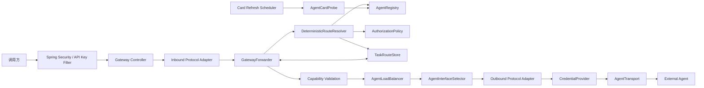

# A2A4J Agent Gateway 架构与详细设计

## 1. 文档基线

| 项目 | 当前值 |
| --- | --- |
| 项目版本 | A2A4J `0.0.1` |
| Java | 17 |
| Spring Boot | 3.5.16 |
| A2A 协议 | `1.0` |
| 已实现 Binding | JSON-RPC、HTTP+JSON、SSE |
| 未实现 Binding | gRPC |
| 默认状态实现 | 单进程内存 |
| 最后核对 | 2026-08-02 |

本文只描述当前仓库已经实现的架构和明确的替换边界。接口请求示例与错误码见
[API 参考](./api-reference.md)，逐步转发时序见[请求转发链路](./request-forwarding-flow.md)，实施记录见
[MVP Backlog](./mvp-backlog.md)。

当前 Core、Client、Server Starter、Samples 和 Gateway 均已使用 A2A 1.0 方法名和边界；不再把它们描述为
“等待从 0.2.1 迁移”。仓库没有 `a2a4j-compat-v021`，也不接受旧版 Wire 方法名。

## 2. 目标与当前边界

Gateway 当前提供：

- 配置驱动的 Agent 注册和周期性 Agent Card 拉取；
- JWT/API Key 入站认证、租户隔离和 Agent/Skill/Task 授权；
- 显式 Agent、精确 Skill、上下文亲和、任务亲和和租户默认 Agent 路由；
- 同一逻辑 Agent 多实例的加权最少在途选择、单实例 bulkhead 和小型熔断器；
- A2A 1.0 JSON-RPC、HTTP+JSON 和 SSE 转发；
- JSON-RPC 与 HTTP+JSON 双向转换；
- Gateway Task/Context ID 与上游 ID 隔离；
- `SendMessage`、`SendStreamingMessage`、任务查询/列举/取消/订阅、Push Notification 配置和扩展 Agent Card；
- 请求大小、响应大小、SSE 单事件大小、流空闲时间和租户并发流限制；
- Micrometer 指标、结构化审计、W3C Trace Context 透传和 Actuator 健康指标；
- 可替换的 Registry、Route、Store、Authorization、Credential、Transport 和 Protocol SPI。

当前未实现：

- gRPC Binding 和 A2A 0.2.1 兼容层；
- Redis/JDBC 等共享状态实现及 Gateway 多副本任务恢复；
- 独立控制平面、动态注册写 API、配置版本和热更新；
- OBO、mTLS、Vault/KMS 默认 Provider、外部策略引擎；
- 自动重试、调用方 deadline 协商和跨实例任务迁移；
- OpenTelemetry span 自动创建、分布式限流和完整计费；
- LLM 语义路由和多 Agent 工作流编排。

## 3. 模块和依赖关系

```text
a2a4j-core
  A2A 1.0 公共常量、模型、校验器及单 Agent Client/Server

a2a4j-gateway-api
  不依赖 Spring 的不可变 Gateway 模型和 SPI
  -> 依赖 a2a4j-core

a2a4j-gateway-core
  发现、路由、授权、负载均衡、协议适配、任务映射和传输
  -> 依赖 a2a4j-gateway-api、a2a4j-core

a2a4j-gateway-spring-boot-starter
  WebFlux Controller、Spring Security、配置、自动装配、审计、指标和健康检查
  -> 依赖 gateway-core、gateway-api

a2a4j-samples/gateway-hello-world
  可执行 Gateway 示例，连接两个 server-hello-world 进程
```

Gateway 不复用 `DefaultDispatcher` 作为多 Agent 路由器。它只复用 `a2a4j-core` 中的
`A2AProtocolV1`、`A2AProtocolV1Validator` 及共同的 Reactor/Jackson 基础；数据面内部使用
`GatewayCommand`、`GatewayResult` 和 `GatewayEvent`，避免把某个 Binding 的 envelope 带入路由核心。

当前 Java 包按职责分布为：

```text
io.github.a2ap.gateway.api.model
io.github.a2ap.gateway.api.spi
io.github.a2ap.gateway.core.discovery
io.github.a2ap.gateway.core.forwarding
io.github.a2ap.gateway.core.protocol
io.github.a2ap.gateway.core.routing
io.github.a2ap.gateway.core.security
io.github.a2ap.gateway.core.store
io.github.a2ap.gateway.core.transport
io.github.a2ap.gateway.spring
```

## 4. 逻辑架构



逻辑上分为三个平面：

| 平面 | 当前职责 | 当前实现 |
| --- | --- | --- |
| 数据平面 | 鉴权、解码、路由、转发、SSE、错误映射 | Spring WebFlux + Gateway Core |
| 控制/发现平面 | YAML 注册、Card 拉取、公开 Card 投影、只读 Agent 查询 | 同进程 Starter |
| 状态平面 | Agent 快照、Task Route、幂等记录、负载与熔断状态 | 单进程内存 |

多个 Gateway 副本之间不会共享 Task Route、幂等记录、租户流配额或熔断状态，因此当前默认部署模型是单实例。

## 5. 核心模型和 SPI

### 5.1 Agent 快照

`AgentDefinition` 保存租户、逻辑 Agent ID、显示名、启用状态、Skills、控制面路由标签、协议策略、实例列表和
Card metadata。`AgentInstance` 保存 Card URL、接口、权重、凭据引用、健康状态、Card hash 和最后检查时间。

`AgentInterface` 包含：

```text
interfaceKey
endpointUrl
protocolBinding
protocolVersion
upstreamTenant
```

租户、权重、凭据和路由标签来自可信配置；远端 Card 只提供接口、能力与 Skill 声明。

### 5.2 统一命令

`GatewayCommand` 包含操作、租户、主体、目标提示、Gateway Task/Context ID、消息、configuration、metadata、
幂等键、入站协议、请求版本和扩展 URI。公开入站 Adapter 当前只解析 Agent 与 Skill 提示，
`TargetHint.labels` 仅供扩展代码直接构造命令时使用。

### 5.3 Task Route

`TaskRoute` 当前保存：

```text
tenantId, gatewayTaskId, gatewayContextId,
agentId, instanceId, interfaceKey,
upstreamTaskId, upstreamContextId,
protocolBinding, protocolVersion,
principalFingerprint, idempotencyKey,
state, createdAt, updatedAt, expiresAt,
taskSnapshot, statusTimestamp
```

`(tenantId, gatewayTaskId)` 是内存 Store 的查询键。任务创建时先保存上游 ID 为空的 `PENDING` Route；收到同步响应
或流式事件后更新上游 ID、状态和快照。后续任务操作必须再次匹配租户和主体指纹。

### 5.4 当前 SPI

- `AgentRegistry`：按租户获取、筛选和替换 Agent 快照；
- `RouteResolver`：把命令解析为唯一逻辑 Agent；
- `AgentLoadBalancer`：选择新实例或固定实例；
- `AgentInterfaceSelector`：选择 Agent Card 中的兼容接口；
- `ProtocolAdapter`：入站解码、出站编码、上游响应解码；
- `AgentTransport`：普通交换和 SSE 交换；
- `TaskRouteStore`：查找、分页、保存和 touch；
- `IdempotencyStore`：预留、完成和标记结果未知；
- `AuthorizationPolicy`：租户、Agent、Skill 和 Task 授权；
- `CredentialProvider`：按实例凭据引用解析出站身份；
- `GatewayMetrics`、`GatewayAuditSink`：可观测性出口。

SPI 都是 Reactor `Mono`/`Flux` 边界；自定义实现不得在事件循环中执行阻塞 I/O。

## 6. Agent 发现、注册与健康

当前注册流程：

1. `GatewayProperties` 从 `a2a.gateway.agents` 读取逻辑 Agent 和实例；
2. `AgentCardRefreshScheduler` 启动时刷新，随后按 `refresh-interval` 周期刷新；
3. `ReactorNettyAgentCardFetcher` 请求配置的 `card-url`，携带 `A2A-Version: 1.0`；
4. `A2AProtocolV1Validator` 校验 Card，`AgentCardNormalizer` 规范化接口和 Skills；
5. `InMemoryAgentRegistry` 原子替换逻辑 Agent 快照；
6. 连续失败达到 `unhealthy-after-failures` 后标记 `UNHEALTHY`，此前为 `DEGRADED`。

当前主动探测只有 Agent Card URL，没有独立可配置的 health endpoint。Card 拉取不跟随重定向。Card URL 和 Card
中的接口 URL 都经过 `AgentCardUrlPolicy`：默认要求 HTTPS、拒绝私网/loopback/link-local；开发环境可显式允许
HTTP、私网或指定 CIDR。

Agent 实例健康枚举为 `UNKNOWN`、`HEALTHY`、`DEGRADED`、`UNHEALTHY`。只有 `HEALTHY` 实例可接收新任务；
已有任务仍尝试固定实例，但会受实例存在性和 bulkhead 限制。

发现入口：

| 路径 | 认证 | 说明 |
| --- | --- | --- |
| `/.well-known/agent-card.json` | 开启内置安全链时免认证 | 默认 Agent 的 Gateway 投影 Card |
| `/.well-known/agents/{agentId}/agent-card.json` | 开启内置安全链时免认证 | Agent-specific 投影 Card |
| `/agents`、`/gateway/v1/agents` | 需要主体 | 当前租户可见 Agent |
| `/agents/{agentId}` | 需要主体 | 规范化 Agent 信息 |
| `/agents/{agentId}/card` | 需要主体 | Gateway 投影后的公共 Card |

Gateway 投影 Card 只声明可由 Gateway 入口承载且上游支持的能力，不暴露上游内部 URL、签名或安全要求。

## 7. 路由、能力校验和实例选择

实际路由顺序：

1. 有 `gatewayTaskId`：查询 Task Route；
2. `SendMessage`/`SendStreamingMessage` 有 `gatewayContextId`：查询同租户、同主体的上下文 Route；
3. 路径 `{agentId}`；Controller 会用它覆盖 `X-A2A-Target-Agent`；
4. `X-A2A-Target-Agent`；
5. `X-A2A-Target-Skill`；
6. 内部命令的 `TargetHint.labels`；公开 HTTP API 当前不能传标签；
7. `default-agent-by-tenant`；
8. 没有唯一结果则拒绝，不随机选择。

显式 Agent 同时携带 Skill 或标签时，Agent 必须满足这些约束。Skill/标签匹配到多个已授权 Agent 时返回冲突错误。

路由过程中执行 `DefaultAuthorizationPolicy`：

- 消息调用需要 `agent:invoke` 或 `agent:invoke:{agentId}`；
- 指定 Skill 还需要 `skill:invoke` 或 `skill:invoke:{skillId}`；
- 查询、订阅和 Push 配置需要 `task:read`；
- 取消需要 `task:cancel`；
- 扩展 Card 需要 `agent:discover`；
- `*` 可匹配所有权限。

取得 Agent 后，`GatewayForwarder` 校验 Streaming、Push Notification、Subscription 和扩展 Card 能力。

新任务由 `WeightedLeastActiveLoadBalancer` 在 `HEALTHY` 实例中按
`activeRequests / weight` 选择，平分时轮询。默认每实例最大 100 个在途请求；连续 3 次失败打开熔断器 10 秒，
之后进入半开探测。上述三个值目前是代码默认值，不是 `GatewayProperties` 配置项。

任务/上下文亲和请求使用 `choosePinned`，并严格复用 Route 中保存的实例、`interfaceKey`、Binding 和版本，不会
重新负载均衡或切换协议。

## 8. 数据面入口

### 8.1 JSON-RPC

三个入口行为相同：

```text
POST /a2a
POST /gateway/v1/a2a
POST /gateway/v1/agents/{agentId}/a2a
```

非流式调用协商 `application/json`；`SendStreamingMessage` 和 `SubscribeToTask` 必须使用
`Accept: text/event-stream` 才会进入流式入口。当前支持 11 个 A2A 1.0 JSON-RPC 方法。

### 8.2 HTTP+JSON

HTTP+JSON 同时提供规范短路径、`/gateway/v1` 路径和 Agent-specific 路径。主要操作为：

| 操作 | 短路径 |
| --- | --- |
| 发送消息 | `POST /message:send` |
| 流式发送 | `POST /message:stream` |
| 查询/列举任务 | `GET /tasks/{taskId}`、`GET /tasks` |
| 取消/订阅任务 | `POST /tasks/{taskId}:cancel`、`POST /tasks/{taskId}:subscribe` |
| 创建/查询/列举/删除 Push 配置 | `/tasks/{taskId}/pushNotificationConfigs...` |
| 扩展 Agent Card | `GET /extendedAgentCard` |

完整 27 个路由变体见 [API 参考](./api-reference.md)。

两种入站 Binding 都要求显式 `A2A-Version: 1.0`，也都兼容同名 Query 参数。缺失或非 `1.0` 最终返回
`VersionNotSupportedError`。请求体上限在 Adapter 解码前按 UTF-8 字节数检查。

## 9. 协议选择与转换

新任务的出站接口默认优先级为：

```text
JSONRPC > HTTP+JSON
```

只选择 `protocolVersion: "1.0"` 且存在已注册 Adapter 的接口。已有 Route 精确复用原接口。

支持矩阵：

| 北向 | 南向 | 当前状态 |
| --- | --- | --- |
| JSON-RPC | JSON-RPC | 支持 |
| HTTP+JSON | HTTP+JSON | 支持 |
| JSON-RPC | HTTP+JSON | 支持，重新包装 JSON-RPC envelope |
| HTTP+JSON | JSON-RPC | 支持，提取 JSON-RPC result/error |
| SSE | SSE | 支持，逐事件桥接 |
| gRPC | 任意 | 未实现 |

Adapter 负责转换 message、configuration、Task ID、Context ID、错误和扩展头。`returnImmediately` 只是
`SendMessage.configuration`，Gateway 会原样传给上游；它不会把同步入口变成 SSE。

上游响应中的 Task/Context ID 在离开 Gateway 前递归改写为 Gateway ID。JSON-RPC request `id` 只用于请求匹配，
不等于任务 ID。

## 10. 任务、幂等与 SSE

### 10.1 新任务

`SendMessage` 和 `SendStreamingMessage` 会先生成 Gateway Task/Context ID，并在真正调用 Transport 前保存
`PENDING` Route。同步响应或流式事件到达后，再保存上游 ID、任务状态、快照和独立的 `statusTimestamp`。

调用方必须使用 Gateway Task ID 执行后续操作；上游 ID 不会返回给调用方。

### 10.2 上下文与任务亲和

带已有 Gateway Context ID 的新消息会定位同租户、同主体的最近 Route，并将 Context ID 改写为上游 Context ID。
带 Gateway Task ID 的查询、取消、订阅和 Push 配置操作定位原 Agent、实例和接口。

终态 Route（完成、失败、取消、拒绝）不能再次调用 `SubscribeToTask`。订阅成功事件来自上游；Gateway 不自行合成
首个 Task，但当前 A2A4J Server 实现会首先发送当前完整 Task 快照。

### 10.3 ListTasks

`ListTasks` 不访问外部 Agent，而是从 `TaskRouteStore` 投影 Gateway 已保存的快照。查询按租户、主体指纹、Agent、
Context、状态和状态时间过滤，使用不透明 cursor，`pageSize` 为 1～100。`historyLength` 和
`includeArtifacts` 控制快照投影；流式 Artifact append 会合并同一 Artifact 的 parts。

### 10.4 幂等

携带 `Idempotency-Key` 时，Gateway 使用租户、Key 和规范化请求 hash：

- `IN_FLIGHT`：拒绝并发重复请求；
- `COMPLETED`：重放保存的 `GatewayResult`；
- `OUTCOME_UNKNOWN`：拒绝自动重试；
- 相同 Key 携带不同请求 hash：返回冲突。

当前 Store 为内存实现。Gateway 不自动重试 `SendMessage`，Transport 结果未知时也不会切换实例重发。

### 10.5 SSE

- 仅 `SendStreamingMessage`、`SubscribeToTask` 可进入流式 Forwarder；
- 上游必须先返回 2xx，之后才解析 SSE；
- 每个事件单独解码、改写 ID、更新快照并立即发给客户端；
- `Last-Event-ID` 转发给上游；
- 下游取消会取消 Reactor 链并释放实例在途计数；
- `stream-idle-timeout` 控制事件间最大空闲时间；
- `TenantStreamLimiter` 只限制单节点、单租户并发 SSE，不限制普通请求；
- 内存状态不能支持跨 Gateway 副本恢复。

## 11. 安全架构

入站身份和出站身份严格分离。调用方 JWT/API Key 不会透传给 Agent；出站凭据由实例的 `credential-ref` 解析。
默认 `EnvironmentCredentialProvider` 只接受 `env://NAME` 并生成 Bearer Token。Vault、KMS、mTLS 或 OBO 需要提供
自定义 `CredentialProvider`/Transport。

`a2a.gateway.security.enabled` 默认为 `false`，表示内置 Spring Security 自动配置不启用；但数据面 Controller
仍要求存在 `GatewayAuthenticationToken`。应用必须启用 JWT/API Key 模式，或提供自己的认证链，否则受保护的数据面
请求会返回未认证错误。

JWT 模式支持 issuer discovery 或显式 JWK Set URI，校验 audience、时间和配置的 tenant/subject/authority claims。
API Key 模式只在开发场景使用，secret 从 `secret-env` 指定的环境变量读取，配置中不保存明文。

内置安全链放行 Actuator health/info 和两个 well-known Card 路径，其余请求要求认证。日志和审计不记录正文、Token、
API Key 或凭据值。

## 12. 传输、超时和资源保护

`ReactorNettyAgentTransport` 使用有界连接池，按 `OutboundRequest.httpMethod` 发送 POST、GET 或 DELETE，并执行：

- 配置 URL 和 DNS 解析后 IP 的 SSRF 校验；
- 禁止自动重定向；
- `connect-timeout` 和 `response-timeout`；
- `max-response-bytes` 普通响应上限；
- `max-event-bytes` SSE 单事件上限；
- 上游状态码和 Content-Type 处理；
- 出站 Authorization 与 trace headers 注入。

当前没有调用方 deadline Header 解析，也没有自动重试。`RoutingContext.deadline` 固定为当前时间加
`response-timeout`，用于路由和负载均衡阶段的过期检查。当前没有独立的 Part 数量/单 Part 大小限制；总体请求体由
`max-request-bytes` 约束。

`WeightedLeastActiveLoadBalancer` 提供每实例 100 在途请求 bulkhead 和熔断；`TenantStreamLimiter` 提供每租户
流配额。普通请求没有单独的租户并发配额。

## 13. 错误边界

同步路径先把上游 HTTP/JSON-RPC 错误归一化，再按入站 Binding 输出。流式路径在发出首帧前检查上游状态；上游
SSE 建连返回 4xx/5xx 时不会先提交 `200 text/event-stream`，也不会把错误塞进成功事件 oneof。

标准 A2A 错误优先使用 `-32001`～`-32009`。无标准等价项的 Gateway 路由、冲突、不可用、策略拒绝和限流错误使用
私有错误映射。认证失败在 HTTP 层返回 401/403。错误响应不得包含内部 URL、凭据引用或堆栈。

详细映射以 [API 参考](./api-reference.md) 和两个 Error Handler 为准。

## 14. 状态实现

| 状态 | 当前实现 | 容量/过期行为 |
| --- | --- | --- |
| Agent 快照 | `InMemoryAgentRegistry` | 配置 Agent 集合，原子替换；失败计数在内存中 |
| Task Route | `InMemoryTaskRouteStore` | 默认最多 10000 条；访问、列举、保存时惰性清理 TTL |
| 幂等记录 | `InMemoryIdempotencyStore` | 默认最多 10000 条；按 `idempotency-ttl` 惰性清理 |
| 流配额 | `TenantStreamLimiter` | 进程内计数 |
| 在途/熔断 | `WeightedLeastActiveLoadBalancer` | 进程内计数和状态 |

不存在独立的 `InMemoryHealthStore`。Store 没有后台清理线程；达到容量时淘汰最旧记录，过期记录在操作时清理。
Starter 为两个默认 Store 注册 entries、capacity、evictions 和 expired 指标。

生产多副本需要替换 `TaskRouteStore` 和 `IdempotencyStore`，并额外解决事件游标、流配额与熔断状态共享；只替换
Task Route 并不足以获得完整高可用语义。

## 15. 可观测性

### 15.1 请求关联与追踪

`GatewayRequestIdResolver` 优先读取 `X-Gateway-Request-Id`；缺失时生成一次 UUID 并缓存到
`ServerWebExchange`，数据面和 HTTP access 审计复用同一值；`GatewayAccessLogWebFilter` 将最终值写入同名响应头。

Gateway 校验 W3C version 00 `traceparent`，提取 trace ID，并将合法 `traceparent`/`tracestate` 透传给上游。
缺失合法 trace 时使用 request ID 作为内部 trace ID。当前没有自动创建 ingress/auth/route/upstream OTel spans。

### 15.2 指标

`GatewayMetrics` 当前发出：

```text
gateway.requests.total
gateway.request.duration
gateway.streams.started
gateway.stream.duration
gateway.protocol.errors
```

`GatewayStoreMetrics` 注册：

```text
gateway.store.entries
gateway.store.capacity
gateway.store.evictions
gateway.store.expired
```

有 `MeterRegistry` 时使用 `MicrometerGatewayMetrics`，否则为 no-op。当前没有 Agent health、route decision、协议转换、
active request 或 circuit state 的默认 Micrometer 指标。

### 15.3 审计与健康

默认 `Slf4jGatewayAuditSink` 记录无正文的结构化事件。`GatewayAccessLogWebFilter` 记录每个 HTTP exchange，两个
Controller 记录转发结果或流启动/错误；sink 异常不会改变数据面响应。

Starter 提供：

- `gatewayAgentHealthIndicator`：汇总 Card/实例状态；
- `gatewayDependencyHealthIndicator`：判断是否存在健康上游实例。

应用决定 Actuator 暴露范围以及 readiness/liveness 分组，Starter 不自动修改这些分组。

## 16. 当前配置

以下属性与 `GatewayProperties`、`GatewaySecurityProperties` 一致：

```yaml
a2a:
  gateway:
    enabled: true
    allow-http: false
    allow-private-network: false
    allowed-cidrs: []
    max-card-bytes: 1048576
    card-timeout: 5s
    connect-timeout: 2s
    response-timeout: 60s
    max-response-bytes: 4194304
    max-request-bytes: 1048576
    max-event-bytes: 1048576
    stream-idle-timeout: 30s
    max-concurrent-streams: 200
    refresh-interval: 5m
    unhealthy-after-failures: 3
    task-route-ttl: 24h
    task-route-max-entries: 10000
    idempotency-ttl: 24h
    idempotency-max-entries: 10000
    default-agent-by-tenant:
      tenant-a: research-agent
    agents:
      - tenant-id: tenant-a
        agent-id: research-agent
        display-name: Research Agent
        enabled: true
        routing-labels:
          region: cn
        protocol-versions: ["1.0"]
        protocol-bindings: ["JSONRPC", "HTTP+JSON"]
        instances:
          - instance-id: research-agent-1
            card-url: https://research.example.com/.well-known/agent-card.json
            weight: 100
            credential-ref: env://RESEARCH_AGENT_TOKEN
    security:
      enabled: true
      mode: jwt
      jwt:
        issuer-uri: https://id.example.com
        audiences: [a2a-gateway]
        tenant-claim: tenant_id
        subject-claim: sub
        authority-claims: [scope, roles]
        clock-skew: 30s
```

配置启动校验覆盖：大小和时间参数、流配额、Store 容量、重复租户/Agent、重复实例、空协议策略、默认 Agent 引用、
Card URL 语法和网络策略。默认 Provider 只在实际解析 `credential-ref` 时校验 `env://` 格式和环境变量是否存在；
当前不在启动时比较同一逻辑 Agent 各实例的完整能力一致性。

## 17. 示例部署

[`gateway-hello-world`](../../a2a4j-samples/gateway-hello-world/README.md) 使用三个进程：

```text
echo-a Agent :8091  -> hello-world、code-generation
echo-b Agent :8092  -> task-summary
Gateway      :8099  -> API Key、发现、路由和转发
```

示例中每个逻辑 Agent 只有一个实例，用于验证多 Agent 和 Skill 路由。负载均衡多实例行为由
`WeightedLeastActiveLoadBalancerTest` 和数据面 E2E 测试覆盖，而不是由该示例部署覆盖。

## 18. 已验证能力与明确限制

当前测试覆盖：

- Agent Card 发现、校验、原子刷新和失败降级；
- 显式 Agent、Skill、默认 Agent、任务/上下文亲和与冲突拒绝；
- 加权最少在途、bulkhead、熔断与固定实例；
- 11 个 JSON-RPC 方法、HTTP+JSON 路由和双向 Binding 转换；
- Task/Context ID 隔离、ListTasks 快照、Push 配置和扩展 Card；
- 200 个并发 SSE、流取消、事件大小、状态错误和 ID 改写；
- JWT/API Key、租户/主体隔离、权限矩阵和 SSRF；
- request ID、trace header、指标、审计与健康指标。

当前限制：

- 内存状态在重启后丢失；
- 没有跨 Gateway 副本一致性；
- 没有自动重试和性能 SLO 承诺；
- 没有持久化审计、配置审批、动态注册和签名信任链；
- 路由标签不能通过公开 HTTP API 传入；
- 默认没有 OTel spans、分布式配额或生产凭据 Provider。

## 19. 架构决策

### ADR-001：Gateway 与 DefaultDispatcher 分离

`DefaultDispatcher` 负责单 Agent 方法分派；Gateway 的多租户注册、路由、协议转换和 Task Route 属于独立职责。

### ADR-002：核心使用协议无关命令

`GatewayCommand`、`GatewayResult` 和 `GatewayEvent` 隔离 Binding，使路由、鉴权和任务逻辑不复制到每个协议入口。

### ADR-003：Gateway ID 与上游 ID 分离

分离可隐藏内部拓扑、避免不同 Agent ID 冲突，并强制后续操作经过租户、主体和 Route 校验。

### ADR-004：入站身份不默认透传

Gateway 是安全边界；默认使用按实例配置的出站身份，避免 audience 错配和 confused deputy。

### ADR-005：新任务 JSON-RPC 优先，已有任务接口固定

新任务默认选择 JSON-RPC 1.0，缺失时回退 HTTP+JSON。任务建立后固定实例和接口，避免后续操作跨 Binding 漂移。

### ADR-006：MVP 使用单节点内存状态

内存实现便于验证协议和治理边界，但不宣称高可用。企业部署必须提供共享 Store，并重新设计事件恢复和分布式配额。

## 20. 后续演进

建议按以下顺序扩展：

1. Redis/JDBC Task Route 与幂等 Store，以及多副本恢复语义；
2. 可配置 bulkhead/熔断、分布式流配额和完整指标；
3. OTel spans、持久化审计和配置版本控制；
4. Vault/KMS、mTLS、OBO 与外部策略引擎；
5. gRPC Binding 和 Agent Card 签名验证；
6. 有真实需求时再提供隔离的 0.2.1 兼容模块；
7. 语义路由或工作流作为 Gateway 之上的独立层，而不是塞入基础转发核心。
