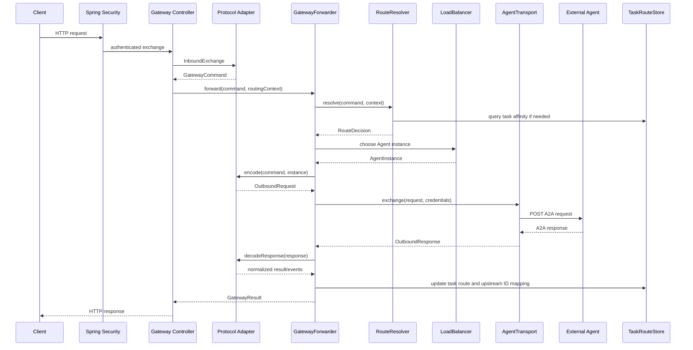

# 客户端请求经过 Gateway 转发到 Agent 的链路

本文结合当前项目代码，说明一次客户端请求如何进入 Gateway、完成鉴权和路由、转发到外部 Agent，再将结果返回给客户端。

本文以同步 `SendMessage` 为主，同时说明 JSON-RPC、HTTP+JSON、SSE 流式请求以及任务操作的差异。除
`ListTasks` 由 Gateway 本地的 `TaskRouteStore` 直接提供外，其余数据面操作会按下述流程选择并访问外部 Agent。

## 1. 总体链路



Gateway 不是简单地把客户端请求原样反向代理给 Agent，而是先将请求转换为统一的 `GatewayCommand`，再根据租户、Agent、Skill、Task 和 Agent Card 重新选择出站协议与实例。

## 2. 请求入口

### 2.1 HTTP+JSON 同步入口

客户端可以调用：

```http
POST /gateway/v1/agents/research-agent/message:send
Content-Type: application/a2a+json
A2A-Version: 1.0
Authorization: Bearer <gateway-token>
```

入口代码是 [`GatewayHttpJsonController.send`](../../a2a4j-gateway-spring-boot-starter/src/main/java/io/github/a2ap/gateway/spring/GatewayHttpJsonController.java)。

该方法接收请求体，然后调用：

```java
dispatch(agentId, null, GatewayCommand.Operation.SEND_MESSAGE, payload, exchange)
```

随后进入 `dispatch`，依次调用 `decode`、`forwarder.forward` 和 `toResponse`。

### 2.2 JSON-RPC 入口

JSON-RPC 请求使用：

```http
POST /gateway/v1/agents/research-agent/a2a
Content-Type: application/json
Accept: application/json
A2A-Version: 1.0
Authorization: Bearer <gateway-token>
```

入口代码是 [`GatewayJsonRpcController.invoke`](../../a2a4j-gateway-spring-boot-starter/src/main/java/io/github/a2ap/gateway/spring/GatewayJsonRpcController.java)。

JSON-RPC 流式请求仍使用同一路径，但 `Accept` 必须为 `text/event-stream`。Controller 会根据请求类型选择同步 `forward` 或流式 `stream`。

## 3. 入站鉴权和上下文构造

启用 JWT 或 API Key 鉴权时，Spring Security 过滤器先处理请求。认证成功后，Controller 从 `ServerWebExchange` 取得 `GatewayAuthenticationToken`，转换成 `PrincipalContext`。

相关代码：

- [`GatewaySecurityAutoConfiguration`](../../a2a4j-gateway-spring-boot-starter/src/main/java/io/github/a2ap/gateway/spring/GatewaySecurityAutoConfiguration.java)
- [`GatewayHttpJsonController.principal`](../../a2a4j-gateway-spring-boot-starter/src/main/java/io/github/a2ap/gateway/spring/GatewayHttpJsonController.java)

`PrincipalContext` 会进入后续的 `GatewayCommand`，包含租户、主体、权限和主体指纹。

Controller 同时创建 `RoutingContext`：

```java
new RoutingContext(requestId, traceId, deadline, metadata)
```

其中 `requestId` 用于请求关联，`traceId` 用于链路追踪，`deadline` 由 `response-timeout` 计算。没有
`X-Gateway-Request-Id` 时，`GatewayRequestIdResolver` 会生成 UUID 并保存到当前 `ServerWebExchange`；解码、
`RoutingContext` 和审计在同一次请求中复用该值，`GatewayAccessLogWebFilter` 还会在响应头返回最终 request ID。

## 4. 解码为 GatewayCommand

### 4.1 HTTP+JSON

[`GatewayHttpJsonController.decode`](../../a2a4j-gateway-spring-boot-starter/src/main/java/io/github/a2ap/gateway/spring/GatewayHttpJsonController.java) 会：

1. 检查请求体大小；
2. 复制请求 Header；
3. 将路径中的 `agentId` 写入目标 Agent；
4. 将路径中的 `taskId` 写入 Gateway Task；
5. 写入 `GATEWAY_OPERATION`；
6. 创建 `InboundExchange`；
7. 调用 `HttpJsonProtocolAdapter.decode`。

Adapter 解析 `message`、`configuration`、`contextId`、任务 ID、目标 Agent、目标 Skill、幂等键和追踪 Header，最后构造统一的 `GatewayCommand`。

当前公开 HTTP 边界没有路由标签 Header 或字段，两个入站 Adapter 都会将 `TargetHint.labels` 设为空 Map。
路由标签能力仅适用于扩展代码直接构造的 `GatewayCommand`，不能通过当前 HTTP+JSON 或 JSON-RPC API 指定。

### 4.2 JSON-RPC

[`JsonRpcProtocolAdapter.decode`](../../a2a4j-gateway-core/src/main/java/io/github/a2ap/gateway/core/protocol/JsonRpcProtocolAdapter.java) 还会校验：

- JSON-RPC 版本必须是 `2.0`；
- `id` 不能缺失或为 `null`；
- `method` 必须是支持的 A2A 1.0 方法；
- `params` 必须是对象；
- `A2A-Version` 必须是 `1.0`。

JSON-RPC 的请求 ID 会保存到 `GatewayCommand.metadata` 中。它用于请求匹配，不等于 Gateway Task ID。

## 5. GatewayForwarder 处理同步请求

Controller 调用：

```java
forwarder.forward(command, routingContext(exchange))
```

代码是 [`GatewayForwarder.forward`](../../a2a4j-gateway-core/src/main/java/io/github/a2ap/gateway/core/forwarding/GatewayForwarder.java)。

`forward` 外层负责请求指标，Controller 负责写入审计事件。`forwardInternal` 先判断是否带有
`Idempotency-Key`：

```text
没有 Idempotency-Key -> 直接 execute
有 Idempotency-Key    -> 查询、创建或重放幂等记录
```

对于 `SendMessage`，最终进入 `execute(command, context)`。`configuration.returnImmediately` 不会改变
Gateway 的入口类型，也不会把 `SendMessage` 转换成 SSE；该配置由 Adapter 原样编码给上游 Agent。上游快速返回
活动任务后，客户端使用 Gateway Task ID 调用 `GetTask` 或 `SubscribeToTask`。

`ListTasks` 是一个例外：它完成路由和 `task:read` 鉴权后，直接查询 Gateway 的 `TaskRouteStore` 并返回当前主体
可见的任务快照，不会向外部 Agent 发送 `ListTasks` 请求。

## 6. 路由到哪个 Agent

`execute` 首先调用：

```java
routeResolver.resolve(command, context)
```

当前实现是 [`DeterministicRouteResolver`](../../a2a4j-gateway-core/src/main/java/io/github/a2ap/gateway/core/routing/DeterministicRouteResolver.java)。

### 6.1 已有任务

如果 `GatewayCommand.gatewayTaskId` 不为空，Resolver 会从 `TaskRouteStore` 查询：

```text
(tenantId, gatewayTaskId)
    -> agentId
    -> instanceId
    -> protocolBinding
    -> upstreamTaskId
    -> upstreamContextId
```

因此 `GetTask`、`CancelTask`、`SubscribeToTask` 以及四个 Push Notification 配置操作都会回到原来的 Agent
实例。`SubscribeToTask` 还会在转发前检查路由状态；任务已完成、失败、取消或拒绝时直接返回“不支持订阅终态任务”的错误。

### 6.2 已有上下文

如果 `SendMessage` 或 `SendStreamingMessage` 没有 Task ID，但消息携带 `contextId`，Resolver 会按照以下条件查询
已有 `TaskRoute`：

```text
(tenantId, principalFingerprint, gatewayContextId, optional agentId)
    -> agentId
    -> instanceId
    -> upstreamContextId
```

命中后请求固定到原 Agent 和实例，并在出站编码时把 Gateway Context ID 改写为上游 Context ID。未命中才按新任务
规则选择 Agent。

### 6.3 新任务

新任务的路由优先级是：

1. 路径中的 `{agentId}`，它会覆盖同名目标 Header；
2. `X-A2A-Target-Agent`；
3. `X-A2A-Target-Skill`；
4. `TargetHint.labels`，仅限内部扩展代码构造的命令；
5. 当前租户的默认 Agent。

例如：

```yaml
default-agent-by-tenant:
  tenant-a: research-agent
```

如果请求没有显式目标，就会选择当前租户的 `research-agent`。

### 6.4 路由鉴权

路由过程中还会检查：

- 请求租户是否与认证主体租户一致；
- Agent 是否启用；
- 是否拥有 `agent:invoke` 或 `agent:invoke:{agentId}`；
- 指定 Skill 时是否拥有对应 Skill 权限；
- 任务操作是否拥有 `task:read` 或 `task:cancel`。

## 7. 选择 Agent 实例和出站协议

路由得到逻辑 Agent 后，Gateway 从 `AgentRegistry` 读取 Agent Card 快照，并先校验操作所需能力：

- `SendStreamingMessage`、`SubscribeToTask` 要求 `capabilities.streaming: true`；
- Push Notification 配置操作要求 `capabilities.pushNotifications: true`；
- `GetExtendedAgentCard` 要求扩展 Card 能力；
- `SubscribeToTask` 在 Card 明确声明 subscription 能力为 `false` 时被拒绝。

能力校验通过后，再通过 `AgentLoadBalancer` 选择实例：

```java
loadBalancer.choose(agent, command, context)
```

新任务根据 Agent Card 的 `supportedInterfaces` 选择出站协议，默认优先级是：

```text
JSONRPC > HTTP+JSON
```

已有任务或上下文亲和请求使用 `choosePinned` 固定到原实例，并严格复用 `TaskRoute` 保存的 `interfaceKey`、
`protocolBinding` 和 `protocolVersion`；不会再次按默认优先级切换 Binding。如果该接口已不存在，Gateway 返回接口不可用错误。

实现位于 [`DefaultAgentInterfaceSelector`](../../a2a4j-gateway-core/src/main/java/io/github/a2ap/gateway/core/routing/DefaultAgentInterfaceSelector.java)。

因此可以发生协议转换：

```text
客户端 HTTP+JSON -> 外部 Agent JSON-RPC
客户端 JSON-RPC  -> 外部 Agent HTTP+JSON
```

## 8. 创建 Gateway Task Route

对于 `SEND_MESSAGE` 和 `SEND_STREAMING_MESSAGE`，如果当前请求没有 Gateway Task ID，Gateway 会生成自己的：

```text
gatewayTaskId
gatewayContextId
```

然后创建 `PENDING` 状态的 `TaskRoute`，并在真正发出上游请求前保存。初始记录包含租户、Gateway Task/Context
ID、Agent、实例、接口、协议、主体指纹、幂等键和过期时间；此时尚未收到上游响应，因此 `upstreamTaskId` 和
`upstreamContextId` 都是 `null`。

收到同步响应或流式事件后，Gateway 再提取上游 Task/Context ID、任务状态和快照，更新同一条 `TaskRoute`。

## 9. 编码成上游请求

### 9.1 JSON-RPC 出站

`JsonRpcProtocolAdapter.encode` 会生成：

```json
{
  "jsonrpc": "2.0",
  "id": "rpc-001",
  "method": "SendMessage",
  "params": {
    "message": {
      "messageId": "message-001",
      "role": "ROLE_USER",
      "parts": [{"text": "hello"}]
    },
    "configuration": {
      "returnImmediately": true
    }
  }
}
```

并设置：

```http
Content-Type: application/json
Accept: application/json
A2A-Version: 1.0
```

### 9.2 HTTP+JSON 出站

`HttpJsonProtocolAdapter.encode` 会生成：

```json
{
  "message": {
    "messageId": "message-001",
    "role": "ROLE_USER",
    "parts": [{"text": "hello"}]
  },
  "configuration": {
    "returnImmediately": true
  }
}
```

并设置：

```http
Content-Type: application/a2a+json
Accept: application/a2a+json
A2A-Version: 1.0
```

## 10. 出站认证和 HTTP 传输

如果实例配置：

```yaml
credential-ref: env://RESEARCH_AGENT_TOKEN
```

默认 `EnvironmentCredentialProvider` 会读取环境变量，并生成：

```http
Authorization: Bearer <token>
```

随后调用：

```java
transport.exchange(instance, outbound, credentials)
```

实现位于 [`ReactorNettyAgentTransport`](../../a2a4j-gateway-core/src/main/java/io/github/a2ap/gateway/core/transport/ReactorNettyAgentTransport.java)。Transport 会校验 URL 和 DNS、检查 SSRF 策略、建立连接、设置超时，按照
`OutboundRequest.httpMethod` 使用 POST、GET 或 DELETE 访问接口，检查状态码和响应大小，最后返回
`OutboundResponse`。

## 11. 解析上游响应

Gateway 收到 `OutboundResponse` 后，调用所选 Adapter 的：

```java
decodeResponse(response)
```

Adapter 会识别 HTTP 状态码、JSON-RPC error、HTTP+JSON 错误、Task ID、Context ID 和终态信息。

如果发现协议错误，Gateway 会返回上游协议错误，而不会把非法响应当作普通业务数据返回。

同步响应和流式响应在此处有一个重要差异：同步路径可以先把错误归一化为 `GatewayResult`；流式路径必须在
Adapter 解码或写出第一帧前检查上游 HTTP 状态码。上游 SSE 建连返回 4xx/5xx 时，Forwarder 会先从
JSON-RPC code、ErrorInfo.reason/status 和 HTTP status 推导 canonical A2A error，再抛出绑定无关的错误，
由入口的 HTTP 或 JSON-RPC Error Handler 返回普通错误响应。该场景不会产生 `200 text/event-stream`，也不会把
`error` 放进只允许 `task`/`message`/`statusUpdate`/`artifactUpdate` 的 `StreamResponse` oneof。

## 12. 改写 Task ID 和 Context ID

假设外部 Agent 返回：

```json
{
  "task": {
    "id": "upstream-task-123",
    "contextId": "upstream-context-456"
  }
}
```

Gateway 保存映射：

```text
gateway-task-abc    -> upstream-task-123
gateway-context-def -> upstream-context-456
```

并向客户端返回 Gateway 自己的 ID。实现主要位于 [`GatewayForwarder.completeRoute`](../../a2a4j-gateway-core/src/main/java/io/github/a2ap/gateway/core/forwarding/GatewayForwarder.java) 及两个 Protocol Adapter 的 `rewriteTaskIdentifiers` 方法。

之后客户端必须使用 Gateway ID：

```http
GET /gateway/v1/tasks/gateway-task-abc
```

Gateway 会通过 `TaskRouteStore` 找到原 Agent、实例和上游 Task ID，再向外部 Agent 发起 `GetTask`。

## 13. 返回给客户端

### 13.1 HTTP+JSON 客户端

`GatewayHttpJsonController.toResponse` 会把 `GatewayResult` 转回：

```http
<status> application/a2a+json
```

`Content-Type` 固定为 `application/a2a+json`。HTTP 状态码读取 `GatewayResult.metadata.statusCode`：成功响应通常为
200，上游错误或 Gateway 规范化错误会使用相应的 4xx/5xx 状态码。

如果出站协议是 JSON-RPC，`HttpJsonProtocolAdapter.toHttpJson` 会提取 JSON-RPC 的 `result`，转换成 HTTP+JSON 响应。

### 13.2 JSON-RPC 客户端

`GatewayJsonRpcController.toResponse` 保留 JSON-RPC envelope：

```json
{
  "jsonrpc": "2.0",
  "id": "rpc-001",
  "result": {
    "task": {"id": "gateway-task-abc"}
  }
}
```

客户端的 JSON-RPC `id` 用于请求匹配，Task ID 用于后续任务操作，二者不要混淆。

## 14. SSE 流式链路

流式请求：

```http
POST /gateway/v1/agents/research-agent/message:stream
Content-Type: application/a2a+json
Accept: text/event-stream
A2A-Version: 1.0
```

进入：

```java
forwarder.stream(command, routingContext(exchange))
```

完整链路为：

```text
Client
  -> Gateway Controller
  -> GatewayCommand
  -> RouteResolver
  -> AgentLoadBalancer
  -> ProtocolAdapter.encode
  -> AgentTransport.exchangeStream
  -> check upstream status before SSE decode
  -> External Agent SSE
  -> SSE parser
  -> ProtocolAdapter.decodeResponse
  -> GatewayEvent
  -> Controller.toSse
  -> Client
```

流式请求不会聚合完整响应。Gateway 逐个解析上游事件，转成 `GatewayEvent` 后立即写回客户端。
`max-concurrent-streams` 限制租户并发流数量，`stream-idle-timeout` 限制事件之间的最大空闲时间。
只有上游返回 2xx 后才进入上述事件链；建连失败在响应提交前按入站 Binding 返回 HTTP+JSON 或 JSON-RPC 错误。JSON-RPC 入站的每个成功 SSE 事件都保留 JSON-RPC 2.0 response envelope，即使上游实际使用 HTTP+JSON Binding。

进入流式传输前，Gateway 会根据 Agent Card 检查 `capabilities.streaming`。`SubscribeToTask` 还会检查任务路由
存在、属于当前租户和主体、尚未进入终态，并复用保存的实例及协议接口。当前实现不在 Gateway 端主动合成首个
Task 快照；首个事件来自上游 `SubscribeToTask` 响应，Gateway 负责改写其中的 Task/Context ID。

## 15. 失败处理位置

| 阶段 | 典型问题 | 处理位置 |
| --- | --- | --- |
| 入站认证 | JWT/API Key 无效 | Spring Security |
| 入站解码 | JSON、A2A 版本或请求体非法 | Protocol Adapter |
| 路由 | Agent 不存在、租户不匹配、权限不足 | RouteResolver / AuthorizationPolicy |
| 实例选择 | 没有健康实例 | AgentLoadBalancer / AgentRegistry |
| 协议选择 | Card 没有兼容接口 | AgentInterfaceSelector |
| 能力校验 | Streaming、Push 或扩展 Card 能力未声明 | GatewayForwarder |
| 出站认证 | 凭证不存在或不可用 | CredentialProvider |
| 网络连接 | DNS、TLS、SSRF、超时 | AgentTransport |
| 上游同步响应 | HTTP 错误或非法 A2A 响应 | `GatewayForwarder` 统一分类；Adapter 负责成功 payload 解码 |
| 上游流式建连 | 4xx/5xx、尚未建立 SSE | `GatewayForwarder` 在 `decodeResponse` 前检查状态并抛出规范化错误 |
| 上游流式事件 | 非法 oneof、ID 或事件 payload | ProtocolAdapter / SSE codec |
| 任务关联 | Task Route 不存在或过期 | TaskRouteStore |
| 返回客户端 | 序列化失败 | Controller / Error Handler |

## 16. 关键源码索引

| 作用 | 代码 |
| --- | --- |
| HTTP+JSON Controller | [`GatewayHttpJsonController`](../../a2a4j-gateway-spring-boot-starter/src/main/java/io/github/a2ap/gateway/spring/GatewayHttpJsonController.java) |
| JSON-RPC Controller | [`GatewayJsonRpcController`](../../a2a4j-gateway-spring-boot-starter/src/main/java/io/github/a2ap/gateway/spring/GatewayJsonRpcController.java) |
| 请求关联 ID | [`GatewayRequestIdResolver`](../../a2a4j-gateway-spring-boot-starter/src/main/java/io/github/a2ap/gateway/spring/GatewayRequestIdResolver.java) |
| HTTP+JSON Adapter | [`HttpJsonProtocolAdapter`](../../a2a4j-gateway-core/src/main/java/io/github/a2ap/gateway/core/protocol/HttpJsonProtocolAdapter.java) |
| JSON-RPC Adapter | [`JsonRpcProtocolAdapter`](../../a2a4j-gateway-core/src/main/java/io/github/a2ap/gateway/core/protocol/JsonRpcProtocolAdapter.java) |
| 转发编排 | [`GatewayForwarder`](../../a2a4j-gateway-core/src/main/java/io/github/a2ap/gateway/core/forwarding/GatewayForwarder.java) |
| 路由决策 | [`DeterministicRouteResolver`](../../a2a4j-gateway-core/src/main/java/io/github/a2ap/gateway/core/routing/DeterministicRouteResolver.java) |
| Agent 实例选择 | [`WeightedLeastActiveLoadBalancer`](../../a2a4j-gateway-core/src/main/java/io/github/a2ap/gateway/core/routing/WeightedLeastActiveLoadBalancer.java) |
| 协议接口选择 | [`DefaultAgentInterfaceSelector`](../../a2a4j-gateway-core/src/main/java/io/github/a2ap/gateway/core/routing/DefaultAgentInterfaceSelector.java) |
| 上游 HTTP/SSE 传输 | [`ReactorNettyAgentTransport`](../../a2a4j-gateway-core/src/main/java/io/github/a2ap/gateway/core/transport/ReactorNettyAgentTransport.java) |
| Agent Card 刷新 | [`AgentCardRefreshScheduler`](../../a2a4j-gateway-spring-boot-starter/src/main/java/io/github/a2ap/gateway/spring/AgentCardRefreshScheduler.java) |
| 内存任务路由 | [`InMemoryTaskRouteStore`](../../a2a4j-gateway-core/src/main/java/io/github/a2ap/gateway/core/store/InMemoryTaskRouteStore.java) |
